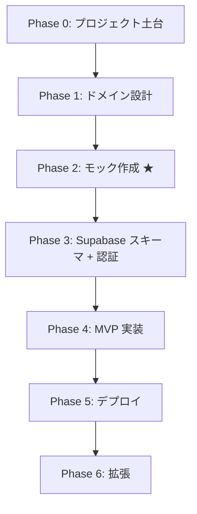

# Cursor チャットエクスポート（生ログ）

> 個人保管用のアーカイブ。プロジェクト開発の参照用ドキュメントではありません。

- **セッション ID**: `63b9415f-d77a-4c27-8038-f3000dd23528`
- **エクスポート日時**: 2026-08-15 10:52:58 
- **元ファイル**: `/home/rabut/.cursor/projects/home-rabut-repos-our-mahjong-history/agent-transcripts/63b9415f-d77a-4c27-8038-f3000dd23528/63b9415f-d77a-4c27-8038-f3000dd23528.jsonl`

---

## 1. ユーザー

**Saturday, Aug 15, 2026, 9:51 AM (UTC+9)**

これからこのフォルダでWebアプリケーションの開発を進めていきます。
Cursorのコード生成をフル活用して開発を進めたいのですが、想定される開発の流れについて説明してください。
開発の流れを決めるにあたって、まず必要な情報(想定している技術スタック、アプリの要件など)あれば、それをまず私に質問してください

---

## 2. アシスタント

まずリポジトリの現状を確認し、技術スタックや要件を整理するうえで必要な質問を用意します。

[REDACTED]

**[tool: Glob]**

```json
{
  "glob_pattern": "**/*",
  "target_directory": "/home/rabut/repos/our-mahjong-history"
}
```

**[tool: Glob]**

```json
{
  "glob_pattern": "**/.cursor/**",
  "target_directory": "/home/rabut/repos/our-mahjong-history"
}
```

**[tool: Glob]**

```json
{
  "glob_pattern": "**/README*",
  "target_directory": "/home/rabut/repos/our-mahjong-history"
}
```

---

## 3. アシスタント

空のフォルダからのスタートのようです。開発の流れを決める前に、いくつか確認させてください。

[REDACTED]

**[tool: AskQuestion]**

```json
{
  "title": "開発方針の確認",
  "questions": [
    {
      "id": "app_type",
      "prompt": "どのような種類のWebアプリを想定していますか？",
      "options": [
        {
          "id": "personal_tool",
          "label": "個人・少人数向けの記録・管理ツール（麻雀の対局履歴など）"
        },
        {
          "id": "community",
          "label": "複数ユーザーが参加するコミュニティ型（ログイン・共有機能あり）"
        },
        {
          "id": "public_service",
          "label": "不特定多数向けの公開サービス（SEO・スケール重視）"
        },
        {
          "id": "internal",
          "label": "社内・限定メンバー向けの内部ツール"
        },
        {
          "id": "undecided",
          "label": "まだ未定（相談しながら決めたい）"
        }
      ]
    },
    {
      "id": "frontend",
      "prompt": "フロントエンドの技術スタックは？",
      "options": [
        {
          "id": "next_react",
          "label": "Next.js + React（推奨：Cursorとの相性が良い）"
        },
        {
          "id": "react_vite",
          "label": "React + Vite"
        },
        {
          "id": "vue",
          "label": "Vue / Nuxt"
        },
        {
          "id": "other_fe",
          "label": "その他 / 未定"
        }
      ]
    },
    {
      "id": "backend",
      "prompt": "バックエンド・データ保存の方針は？",
      "options": [
        {
          "id": "next_fullstack",
          "label": "Next.js フルスタック（API Routes + DB）"
        },
        {
          "id": "separate_api",
          "label": "別APIサーバー（FastAPI, Express など）+ フロント分離"
        },
        {
          "id": "baas",
          "label": "BaaS（Supabase, Firebase など）"
        },
        {
          "id": "frontend_only",
          "label": "フロントのみ（LocalStorage / 静的データ）"
        },
        {
          "id": "undecided_be",
          "label": "未定（相談したい）"
        }
      ]
    },
    {
      "id": "database",
      "prompt": "データベースの希望は？",
      "options": [
        {
          "id": "postgres",
          "label": "PostgreSQL（Supabase 含む）"
        },
        {
          "id": "sqlite",
          "label": "SQLite（小規模・シンプル）"
        },
        {
          "id": "firebase",
          "label": "Fir
...
```

---

## 4. アシスタント

ご回答ありがとうございます。現時点での想定を整理したうえで、Cursorを活用した開発の流れを説明します。

## 現時点の整理

| 項目 | 方針 |
|------|------|
| アプリ種別 | 複数ユーザー向けコミュニティ型 |
| フロント | Next.js + React |
| バックエンド | BaaS（PostgreSQL）→ **Supabase が自然な選択肢** |
| 認証 | あり（メール / OAuth 等） |
| デプロイ | Vercel |
| MVP | 対局記録の登録・一覧・編集 |
| 進め方 | 小さく区切って確認しながら |

リポジトリは現状空フォルダなので、**ゼロからの立ち上げ**になります。

---

## 追加で確認したいこと

開発フローを具体化する前に、以下も教えてください（チャットで自由記述でOKです）。

1. **BaaS は Supabase でよいですか？**（PostgreSQL + 認証 + RLS が一体なので、この構成と相性が良いです）
2. **「コミュニティ」の単位** — 例：固定メンバーの「卓グループ」単位 / 誰でも参加できる公開ルーム / 招待制のみ など
3. **対局記録に含めたい項目** — 例：日付、場所、4人のプレイヤー、各局の点数、最終順位、メモ、写真 など
4. **麻雀のルール** — 日本麻雀（Mリーグ形式など）/ 地方ルール / 点数計算は手入力で十分か
5. **UI言語** — 日本語のみでよいか
6. **デザイン** — シンプルで機能優先 / ある程度こだわりたい など

---

## Cursorを活用した想定開発フロー

「小さく区切って確認しながら」進める前提で、**フェーズ分け**した流れです。

### フェーズ 0：土台づくり（1セッション）

Cursorに任せやすい最初の一手です。

- Next.js プロジェクト初期化（App Router、TypeScript、Tailwind CSS）
- Supabase プロジェクト作成（手元で）→ 環境変数 `.env.local` 設定
- 基本ディレクトリ構成・ESLint / Prettier
- **Cursor Rules**（`.cursor/rules/`）に方針を書く  
  例：「Supabase RLS を必ず使う」「コンポーネントは Server/Client を分ける」

**Cursorへの依頼例：**
> 「Next.js 14 App Router + TypeScript + Tailwind + Supabase Auth の雛形を作成して。Vercel デプロイ前提。」

---

### フェーズ 1：認証（1〜2セッション）

- Supabase Auth（メール + Google 等）
- ログイン / サインアップ / ログアウト
- 認証済みユーザーのみアクセス可能なレイアウト

**確認ポイント：** ログイン〜ダッシュボードまで手動で動作確認

---

### フェーズ 2：データモデル設計（1セッション）

MVP「対局記録」向けの最小スキーマ例：

```
users（Supabase Auth）
groups / rooms（卓グループ）
members（グループ所属）
games（1対局）
game_results（各プレイヤーの結果）
```

- Supabase マイグレーション（SQL）
- **RLS（Row Level Security）** — グループメンバーだけが読み書き可能

**Cursorへの依頼例：**
> 「groups / games / game_results の ER 図と Supabase migration SQL、RLS ポリシーを書いて。」

**確認ポイント：** Supabase Dashboard でテーブルと RLS をレビュー

---

### フェーズ 3：MVP 機能 — 対局記録 CRUD（2〜4セッション）

機能ごとに **1 PR / 1 チャット単位** で進めると Cursor が効きやすいです。

| 順番 | 機能 | 内容 |
|------|------|------|
| 3-1 | 一覧 | 自分が所属するグループの対局一覧 |
| 3-2 | 登録 | 新規対局フォーム（日付、メンバー、点数など） |
| 3-3 | 詳細・編集 | 1件表示、修正、削除 |
| 3-4 | バリデーション | 4人・点数整合など |

各ステップで「動いたら次へ」—— ご希望の進め方に合っています。

---

### フェーズ 4：デプロイ（1セッション）

- GitHub リポジトリ連携
- Vercel にデプロイ（環境変数を Vercel に設定）
- Supabase の Redirect URL を本番 URL に追加

---

### フェーズ 5以降（MVP 後）

当初はスコープ外でしたが、将来の拡張候補：

- 成績・統計
- プレイヤー管理
- 共有・エクスポート
- モバイル UI 改善

---

## Cursor を効かせるコツ

1. **1タスク = 1会話**  
   「対局一覧ページだけ」「RLS だけ」など、スコープを狭くする。

2. **要件を先に文章化**  
   チャット冒頭に「技術スタック」「やること」「やらないこと」を書く。  
   必要なら `docs/requirements.md` を Cursor に作らせて参照させる。

3. **Cursor Rules を早めに置く**  
   命名規則、Supabase の使い方、日本語 UI などを固定すると、生成コードのブレが減る。

4. **生成後は必ず動作確認**  
   `npm run dev` → ブラウザ確認。Cursor に「このエラーを直して」と続ける。

5. **DB 変更は migration で**  
   「テーブル追加して」と頼むときは、SQL ファイル化を明示する。

6. **セキュリティは RLS を最初から**  
   BaaS 利用時は、API より **RLS 設計** を Cursor と一緒にレビューする。

---

## 次のステップ

上記の **追加質問（特に 1〜4）** に答えていただければ、次のチャットで例えば次のように具体化できます。

- フェーズ 0 のプロジェクト初期化をそのまま実行
- ER 図と Supabase スキーマの初稿
- `.cursor/rules` の初期テンプレート

**「Supabase + 招待制グループ + 対局は日付・4人・最終点数のみ」** のように、追加情報を書いていただければ、すぐ着手できます。

[REDACTED]

---

## 5. ユーザー

**Saturday, Aug 15, 2026, 10:13 AM (UTC+9)**

> 追加で確認したいこと
> 開発フローを具体化する前に、以下も教えてください（チャットで自由記述でOKです）。
以下の通りです。
なお、「デザイン」の項でも記載していますが、開発フェーズにはモック作成を追加してください。
追加するタイミングは任せます。最初の方にやって認識を合わせてからCRUD等を検討した方がよければそれでも良いですし、ある程度CRUD等を決めてからモックでもよいです。

> BaaS は Supabase でよいですか？（PostgreSQL + 認証 + RLS が一体なので、この構成と相性が良いです）
Supabaseでよいです

> 「コミュニティ」の単位 — 例：固定メンバーの「卓グループ」単位 / 誰でも参加できる公開ルーム / 招待制のみ など
まずコミュニティは卓や麻雀大会とは独立して存在します。麻雀仲間の単位に作成するイメージです。
一つのコミュニティに複数の麻雀大会が属し、麻雀大会に各試合(半荘など)が属します。

> 対局記録に含めたい項目 — 例：日付、場所、4人のプレイヤー、各局の点数、最終順位、メモ、写真 など
麻雀大会の属性に入れたいもの：日付、大会名、メモ。参加者、最終順位、最終ポイント。写真も入れたいが、MVPでは省く。
試合の属性に入れたいもの：プレイヤー、点数、ポイント、順位、コメント。
※局単位の記録は不要です。試合(半荘)単位の記録で十分です。
※「点数」は純粋な半荘終了時の各プレイヤーの持ち点、「ポイント」はそこからオカやウマ、トビ、風速を加味した点数を言う。

> 麻雀のルール — 日本麻雀（Mリーグ形式など）/ 地方ルール / 点数計算は手入力で十分か
入力は半荘単位なので、アガリ役等は扱わなくてよい。
半荘単位の点数計算に必要な情報は扱う必要がある。
- 例
  三麻、四麻
  ○○点もち××点返し
  ウマ
  トビ
  焼き鳥
  その他フリー

> UI言語 — 日本語のみでよいか
日本語のみ

> デザイン — シンプルで機能優先 / ある程度こだわりたい など
開発の流れの中に、モックのフェーズを入れて、そこで詳細に検討したい。
なお、基本的にはスマホでの利用を想定しており、PCでの表示は妥協よい。

---

## 6. アシスタント

ご回答を反映して、開発フローを具体化しました。モックフェーズは **「ドメインモデル確定の直後・実装の直前」** に置く構成にしています。画面に載せる項目と入力フローを先に固められるため、CRUD実装の手戻りが少なくなります。

---

## 確定した要件サマリー

### ドメイン構造

```
コミュニティ（麻雀仲間の単位）
  └── 麻雀大会（複数）
        └── 試合 / 半荘（複数）
```

- コミュニティは卓や大会とは独立して存在
- 局単位の記録は不要（半荘単位のみ）

### エンティティと属性

| エンティティ | 属性 |
|---|---|
| **麻雀大会** | 日付、大会名、メモ、参加者、最終順位、最終ポイント |
| **試合（半荘）** | プレイヤー、点数（持ち点）、ポイント（ウマ等加味後）、順位、コメント |

- 写真：MVPでは省略
- アガリ役等：扱わない（半荘終了時の集計のみ）

### 点数計算ルール（コミュニティ or 大会単位で設定想定）

- 三麻 / 四麻
- ○○点持ち ××点返し
- ウマ、トビ、焼き鳥
- その他フリー入力

### 技術・非機能

- Supabase（PostgreSQL + Auth + RLS）
- Next.js + React、Vercel デプロイ
- UI：日本語のみ、**スマホファースト**（PCは妥協可）

---

## 更新版：開発フェーズ



---

### Phase 0：プロジェクト土台（1セッション）

**目的：** Cursor が一貫したコードを生成できる環境を整える

| 作業 | 内容 |
|---|---|
| 初期化 | Next.js（App Router）+ TypeScript + Tailwind CSS |
| 設定 | ESLint / Prettier、環境変数テンプレート |
| Cursor Rules | Supabase RLS 必須、日本語 UI、モバイルファースト等 |
| ドキュメント | `docs/domain.md`（用語定義：コミュニティ / 大会 / 試合 / 点数 vs ポイント） |

**成果物：** 動く空アプリ、`npm run dev` で起動確認

---

### Phase 1：ドメイン設計（1セッション）

**目的：** モックと DB 設計の前提を固める（UI はまだ作らない）

#### 検討すること

1. **ER 図（案）**

```
users ──< community_members >── communities
                                    │
                                    └──< tournaments
                                           │
                                           └──< matches
                                                  └──< match_results（プレイヤーごと）

communities ──< scoring_rule_profiles（ルール設定）
```

2. **大会の「参加者・最終順位・最終ポイント」**
   - 試合結果から自動集計 vs 手入力 — モックフェーズで UX を決める
   - おすすめ：試合入力 → 大会サマリーは自動計算 + 手修正可

3. **ルール設定のスコープ**
   - コミュニティ既定 + 大会ごと上書き、など

4. **権限モデル（RLS 前提）**
   - コミュニティメンバーのみ閲覧・編集
   - 招待制の想定（公開ルームは MVP 外）

**成果物：** ER 図、`docs/domain.md` 更新、モック用の画面一覧ドラフト

---

### Phase 2：モック作成 ★（1〜2セッション）

**目的：** スマホ UI の認識合わせ。ここでデザイン・UX を詳細に決める

#### モックで作る画面（案）

| # | 画面 | 主な内容 |
|---|---|---|
| 1 | ログイン / サインアップ | メール + OAuth |
| 2 | コミュニティ一覧 | 所属コミュニティ、新規作成 |
| 3 | コミュニティ詳細 | 大会一覧、メンバー、ルール設定への導線 |
| 4 | ルール設定 | 三麻/四麻、持ち点/返し、ウマ、トビ、焼き鳥、フリー |
| 5 | 大会一覧 | 日付順、大会名 |
| 6 | 大会詳細 | 試合一覧、参加者サマリー、最終順位/ポイント |
| 7 | 大会作成 / 編集 | 日付、大会名、メモ |
| 8 | 試合作成 / 編集 | プレイヤー選択、持ち点入力 → ポイント自動計算 |
| 9 | 試合詳細 | 順位、点数、ポイント、コメント |

#### モックの進め方（Cursor 活用）

1. **画面一覧と遷移図**を Cursor に書かせる
2. **モバイル幅（375px）** のワイヤーフレームを HTML/Tailwind または Figma 風の静的ページで作成
3. **試合入力フロー**を重点レビュー
   - 持ち点入力 → ルール適用 → ポイント・順位表示
   - 三麻時の UI 差分
4. **決定事項を `docs/ui-spec.md` に記録**（実装時の参照用）

#### モックで決める論点（チェックリスト）

- [ ] ナビゲーション（タブ？ハンバーガー？戻るボタン？）
- [ ] 試合入力：1画面 vs ステップ形式
- [ ] ポイント自動計算の UI フィードバック
- [ ] 大会サマリーの自動集計 vs 手入力
- [ ] ルール設定：コミュニティ共通 vs 大会ごと
- [ ] 色・ typography・コンポーネントのトーン

**成果物：** モバイルモック（静的 HTML または Next.js ページ）、`docs/ui-spec.md`

---

### Phase 3：Supabase スキーマ + 認証（1〜2セッション）

**目的：** モックとドメイン設計を反映した DB・認証基盤

| 作業 | 内容 |
|---|---|
| Migration | Phase 1 の ER を SQL 化 |
| RLS | コミュニティメンバーのみアクセス |
| Auth | Supabase Auth（メール + Google 等） |
| 型生成 | `supabase gen types` → TypeScript 型 |

**成果物：** マイグレーション SQL、ログイン〜コミュニティ一覧までの骨格

---

### Phase 4：MVP 実装（3〜5セッション）

モックに沿って **1機能 = 1チャット** で実装。

| 順番 | 機能 | 依存 |
|---|---|---|
| 4-1 | コミュニティ CRUD + 招待 | Auth |
| 4-2 | ルール設定 | コミュニティ |
| 4-3 | 大会 CRUD | コミュニティ |
| 4-4 | 試合 CRUD + ポイント計算 | 大会 + ルール |
| 4-5 | 大会サマリー（順位・ポイント集計） | 試合 |
| 4-6 | 仕上げ | バリデーション、エラー表示、ローディング |

各ステップでスマホ実機 or DevTools のモバイル表示で確認。

**成果物：** MVP 機能が一通り動作

---

### Phase 5：デプロイ（1セッション）

- GitHub → Vercel
- 環境変数、Supabase Redirect URL
- 本番 smoke test

---

### Phase 6：拡張（MVP 後）

- 写真アップロード（Supabase Storage）
- 成績・統計
- PC レイアウト改善
- 通知、エクスポート等

---

## セッション単位の進め方（例）

「小さく区切って確認」向けの **7ステップ** です。

| # | セッション | 内容 | 確認方法 |
|---|---|---|---|
| 1 | Phase 0 | プロジェクト初期化 | `npm run dev` |
| 2 | Phase 1 | ドメイン設計・ER 図 | ドキュメントレビュー |
| 3 | Phase 2 | モック（主要画面） | スマホ幅でスクロール確認 |
| 4 | Phase 2 | モック（試合入力・ルール） | 入力フロー walkthrough |
| 5 | Phase 3 | DB + 認証 | ログイン動作 |
| 6 | Phase 4 | 大会・試合 CRUD | 実データで記録 |
| 7 | Phase 5 | デプロイ | 本番 URL で確認 |

---

## モックフェーズをこの位置に置く理由

| タイミング | メリット | デメリット |
|---|---|---|
| **Phase 1 の直後（推奨）** | ドメイン確定後に UI を決められる。実装前に認識合わせ | ルール計算ロジックはモックでは簡易表示 |
| Phase 0 の直後 | 最速で UI イメージ共有 | フィールド漏れ・構造変更で手戻り |
| CRUD 設計後 | フォーム項目が確定している | 実装開始が遅れ、設計変更コスト大 |

**Phase 1 → Phase 2 → Phase 3 → Phase 4** の順が、今回の要件（複雑なドメイン + スマホ UI 重視 + ルール設定）に最も合うと考えています。

---

## 次のアクション

次のチャットで、次のいずれかから始められます。

1. **Phase 0** — Next.js + Supabase 雛形の作成
2. **Phase 1** — ER 図と `docs/domain.md` の初稿
3. **Phase 2** — 画面一覧とモバイルモックの着手

**「Phase 0 から始めて」** または **「Phase 1 の ER 図から」** など、希望を教えてください。

[REDACTED]

---

## 7. ユーザー

**Saturday, Aug 15, 2026, 10:17 AM (UTC+9)**

実作業に入る前に、他のセッションが、成するアプリの概要・開発の進め方・想定している言語・プラットフォームを参照・理解きるように、ドキュメントの形にしてください。AGENTS.mdの形でもよいですし、そこから参照させる別ドキュメントでも構いません。望ましい形式を検討し、展開してください

---

## 8. アシスタント

他セッション向けの参照ドキュメントを整えるため、まずリポジトリの現状と Cursor の推奨形式を確認します。

[REDACTED]

**[tool: Read]**

```json
{
  "path": "/home/rabut/.cursor/skills-cursor/create-rule/SKILL.md"
}
```

**[tool: Glob]**

```json
{
  "glob_pattern": "**/*",
  "target_directory": "/home/rabut/repos/our-mahjong-history"
}
```

**[tool: Glob]**

```json
{
  "glob_pattern": "**/AGENTS.md",
  "target_directory": "/home/rabut/repos"
}
```

---

## 9. アシスタント

関連プロジェクトの AGENTS.md を参照し、形式のベストプラクティスを確認します。

[REDACTED]

**[tool: Read]**

```json
{
  "path": "/home/rabut/repos/our-mahjong-history_trial/web/AGENTS.md"
}
```

**[tool: Read]**

```json
{
  "path": "/home/rabut/repos/ci-cd-study/web/AGENTS.md"
}
```

**[tool: Read]**

```json
{
  "path": "/home/rabut/repos/spec-kit/AGENTS.md",
  "limit": 80
}
```

---

## 10. アシスタント

[REDACTED]

**[tool: Glob]**

```json
{
  "glob_pattern": "**/*",
  "target_directory": "/home/rabut/repos/our-mahjong-history_trial"
}
```

**[tool: Grep]**

```json
{
  "pattern": "AGENTS\\.md",
  "path": "/home/rabut/repos",
  "glob": "**/README*",
  "head_limit": 20
}
```

---

## 11. アシスタント

[REDACTED]

**[tool: Read]**

```json
{
  "path": "/home/rabut/repos/ai-sandbox2/AGENTS.md"
}
```

**[tool: Glob]**

```json
{
  "glob_pattern": "**/docs/**",
  "target_directory": "/home/rabut/repos/our-mahjong-history_trial"
}
```

---

## 12. アシスタント

[REDACTED]

**[tool: Glob]**

```json
{
  "glob_pattern": "**/*",
  "target_directory": "/home/rabut/repos/ai-sandbox2/docs"
}
```

**[tool: Glob]**

```json
{
  "glob_pattern": "**/*",
  "target_directory": "/home/rabut/repos/ai-sandbox2/.cursor/rules"
}
```

---

## 13. アシスタント

[REDACTED]

**[tool: Read]**

```json
{
  "path": "/home/rabut/repos/ai-sandbox2/docs/ai/dev-workflow.md"
}
```

**[tool: Read]**

```json
{
  "path": "/home/rabut/repos/ai-sandbox2/.cursor/rules/00-core.mdc"
}
```

---

## 14. アシスタント

ai-sandbox2 の構成を参考に、AGENTS.md を入口としたドキュメント群を作成します。

[REDACTED]

**[tool: Write]** `/home/rabut/repos/our-mahjong-history/AGENTS.md`

```
# AI エージェント向けガイド

**Our Mahjong History**（仮称）の開発支援時の入口ドキュメント。新規セッションではまず本ファイルを読み、必要に応じてリンク先を参照すること。

## プロジェクト概要（要約）

麻雀仲間の **コミュニティ** 単位で、**麻雀大会** と **試合（半荘）** の記録を管理する Web アプリ。複数ユーザーが参加するコミュニティ型。MVP は対局記録の登録・一覧・編集。

```
コミュニティ → 麻雀大会（複数） → 試合 / 半荘（複数）
```

## 読む順序

1. 本ファイル（AGENTS.md）— 全体像と最重要ルール
2. [docs/overview.md](docs/overview.md) — アプリ要件・ドメインモデル・用語定義
3. [docs/development.md](docs/development.md) — 開発フェーズ・進め方・現在のフェーズ
4. [docs/tech-stack.md](docs/tech-stack.md) — 言語・プラットフォーム・技術選定
5. 作業内容に応...
```

**[tool: Write]** `/home/rabut/repos/our-mahjong-history/docs/overview.md`

```
# アプリ概要

## 目的

麻雀仲間のグループ（**コミュニティ**）で、麻雀大会および各試合（半荘）の結果を記録・共有する Web アプリケーション。

## 想定ユーザー

- 定期的に麻雀をする仲間同士のグループ
- 大会の結果を後から振り返りたいプレイヤー
- スマートフォンから手軽に記録・閲覧したいユーザー

## アプリ種別

- **コミュニティ型**: 複数ユーザーがログインし、所属コミュニティのデータを共有
- コミュニティは卓や麻雀大会とは独立して存在（麻雀仲間の単位）

---

## ドメイン構造

```
コミュニティ（麻雀仲間の単位）
  └── 麻雀大会（複数）
        └── 試合 / 半荘（複数）
```

- **コミュニティ**: 最上位のグループ。メンバー管理・ルール設定の単位
- **麻雀大会**: ある日開催された大会。複数の試合を含む
- **試合（半荘）**: 半荘 1 回分の記録。**局単位の記録は不要**

---

## 用語定義

| 用語 | 意味 |
|------|------|
| **点数** | 半荘終了時...
```

**[tool: Write]** `/home/rabut/repos/our-mahjong-history/docs/development.md`

```
# 開発の進め方

## 基本方針

- **小さく区切って確認しながら進める**（1 機能 ≒ 1 セッション）
- Cursor のコード生成を活用し、スコープを狭く保つ
- 各フェーズ完了時に動作確認またはドキュメントレビューを行う
- フェーズを飛ばさず、依存関係に従って順に進める

---

## 開発フェーズ一覧

```
Phase 0: プロジェクト土台
    ↓
Phase 1: ドメイン設計
    ↓
Phase 2: モック作成 ★
    ↓
Phase 3: Supabase スキーマ + 認証
    ↓
Phase 4: MVP 実装
    ↓
Phase 5: デプロイ
    ↓
Phase 6: 拡張（MVP 後）
```

### Phase 0: プロジェクト土台

**目的**: Cursor が一貫したコードを生成できる環境を整える

| 作業 | 内容 |
|------|------|
| 初期化 | Next.js（App Router）+ TypeScript + Tailwind CSS |
| 設定 | ESLint / P...
```

**[tool: Write]** `/home/rabut/repos/our-mahjong-history/docs/tech-stack.md`

```
# 技術スタック・言語・プラットフォーム

## 概要

| レイヤ | 技術 | 備考 |
|--------|------|------|
| フロントエンド | Next.js + React | App Router |
| 言語 | TypeScript | フロント・サーバー共通 |
| スタイリング | Tailwind CSS | モバイルファースト |
| BaaS / DB | Supabase | PostgreSQL + Auth + RLS |
| デプロイ | Vercel | フロントエンドホスティング |
| UI 言語 | 日本語 | 日本語のみ |

---

## フロントエンド

### Next.js（App Router）

- **React Server Components** を基本とし、インタラクティブな部分のみ Client Component
- ルーティング: `app/` ディレクトリ配下
- データ更新: Server Actions を優先（方針は Phase 0 で確定）

### TypeScript

- 厳格モー...
```

**[tool: Write]** `/home/rabut/repos/our-mahjong-history/.cursor/rules/00-core.mdc`

```
---
description: プロジェクトのコア方針・共通ルール（必読）
alwaysApply: true
---

# コア方針

## プロジェクト

麻雀仲間の **コミュニティ** 単位で **麻雀大会** と **試合（半荘）** を記録する Web アプリ。詳細は `AGENTS.md` および `docs/overview.md` を参照。

## スタック

- Next.js（App Router）、TypeScript、Tailwind CSS
- Supabase（PostgreSQL + Auth + RLS）
- デプロイ: Vercel
- UI: 日本語のみ、モバイルファースト

## ドメイン用語（厳守）

- **点数** = 半荘終了時の持ち点（素点）
- **ポイント** = ウマ・オカ・トビ等を加味した得点
- **試合** = 半荘 1 回分。局単位の記録は不要

## 最重要ルール

1. **RLS 必須**: コミュニティメンバーのみデータにアクセス可能
2. **MVP スコープ**: 写真・統計・PC 最適化は明示的依頼まで着手...
```

---

## 15. アシスタント

以下の構成でドキュメントを展開しました。

## 採用した形式

**AGENTS.md（入口） + docs/（詳細） + .cursor/rules/（常時適用ルール）** の 3 層構成です。既存プロジェクト（ai-sandbox2）のパターンと Cursor の推奨（`.cursor/rules/` の `alwaysApply`）を組み合わせています。

| 層 | 役割 | 想定読者 |
|---|---|---|
| `AGENTS.md` | 新セッションの最初に読む索引。要約・現在フェーズ・読む順序 | AI エージェント |
| `docs/*.md` | 要件・フェーズ・技術の詳細（人間も読める） | エージェント + 開発者 |
| `.cursor/rules/00-core.mdc` | 毎セッション自動適用される最短ルール | Cursor |

1 ファイルに全部書くと長くなりすぎてエージェントが要点を見落としやすいため、**入口は短く、詳細は docs に分離**しています。

---

## 作成したファイル

```
our-mahjong-history/
├── AGENTS.md                      # 入口（要約・リンク・現在フェーズ）
├── docs/
│   ├── overview.md                # アプリ概要・ドメイン・MVP 範囲
│   ├── development.md             # 開発フェーズ（モック含む）・進め方
│   └── tech-stack.md              # 言語・プラットフォーム・技術選定
└── .cursor/rules/
    └── 00-core.mdc                # 常時適用ルール
```

`docs/ui-spec.md` は Phase 2（モック）完了後に作成する想定で、参照先だけ AGENTS.md に記載しています。

---

## 各ドキュメントの内容

- **`AGENTS.md`** — プロジェクト要約、読む順序、ドキュメント一覧、現在フェーズ（Phase 0 前）、最重要ルール、エージェント向け作業指針
- **`docs/overview.md`** — コミュニティ → 大会 → 試合の構造、点数/ポイントの用語定義、各エンティティの属性、ルール設定、MVP 内外、UI 方針
- **`docs/development.md`** — Phase 0〜6 の詳細、モック対象画面・論点チェックリスト、セッション例、Cursor 活用のコツ、ドキュメント更新ルール
- **`docs/tech-stack.md`** — Next.js / Supabase / Vercel、TypeScript、モバイルファースト、環境変数、想定ディレクトリ構成
- **`.cursor/rules/00-core.mdc`** — スタック・用語・RLS・MVP スコープなど、毎回自動で効く最短ルール

---

## 他セッションでの使い方

新しい Cursor セッションでは、例えば次のように依頼できます。

> `@AGENTS.md` を読んで Phase 0 から始めてください

または

> `@docs/overview.md` のドメインに沿って ER 図を作成してください

フェーズが進んだら、`AGENTS.md` の「現在のフェーズ」と `docs/development.md` の状態を更新してください。

---

次のステップとして **Phase 0（Next.js + Supabase 雛形）** に進めますか？

[REDACTED]

---

## 16. ユーザー

**Saturday, Aug 15, 2026, 10:21 AM (UTC+9)**

プロジェクトの名称は「俺たちの雀歴」です。日本語が使用できる部分はそれに改めてください。しかし、開発に当たっては英語名が必要な時もあると思うので、そこにはOur Mahjong Historyを使用してください。以上の前提で、各ドキュメントをどのように修正したらよいか検討し、修正してください

---

## 17. アシスタント

プロジェクト名の方針を確認し、各ドキュメントを読んで修正箇所を洗い出します。

[REDACTED]

**[tool: Read]**

```json
{
  "path": "/home/rabut/repos/our-mahjong-history/AGENTS.md"
}
```

**[tool: Read]**

```json
{
  "path": "/home/rabut/repos/our-mahjong-history/docs/overview.md"
}
```

**[tool: Read]**

```json
{
  "path": "/home/rabut/repos/our-mahjong-history/docs/development.md"
}
```

**[tool: Read]**

```json
{
  "path": "/home/rabut/repos/our-mahjong-history/docs/tech-stack.md"
}
```

**[tool: Read]**

```json
{
  "path": "/home/rabut/repos/our-mahjong-history/.cursor/rules/00-core.mdc"
}
```

---

## 18. アシスタント

命名規則を各ドキュメントに反映します。日本語表記は「俺たちの雀歴」、開発用識別子は「Our Mahjong History」を使い分けます。

[REDACTED]

**[tool: StrReplace]** `/home/rabut/repos/our-mahjong-history/AGENTS.md`

**[tool: StrReplace]** `/home/rabut/repos/our-mahjong-history/docs/overview.md`

**[tool: StrReplace]** `/home/rabut/repos/our-mahjong-history/docs/development.md`

**[tool: StrReplace]** `/home/rabut/repos/our-mahjong-history/docs/tech-stack.md`

**[tool: StrReplace]** `/home/rabut/repos/our-mahjong-history/docs/tech-stack.md`

**[tool: StrReplace]** `/home/rabut/repos/our-mahjong-history/.cursor/rules/00-core.mdc`

---

## 19. アシスタント

残りの参照箇所を確認し、命名規則を AGENTS.md の最重要ルールにも追記します。

[REDACTED]

**[tool: Grep]**

```json
{
  "pattern": "Our Mahjong History|仮称|Mahjong History",
  "path": "/home/rabut/repos/our-mahjong-history"
}
```

**[tool: StrReplace]** `/home/rabut/repos/our-mahjong-history/AGENTS.md`

**[tool: StrReplace]** `/home/rabut/repos/our-mahjong-history/.cursor/rules/00-core.mdc`

---

## 20. アシスタント

修正しました。名称の使い分け方針と、各ファイルへの反映内容をまとめます。

## 名称の使い分け方針

| 用途 | 名称 | 具体例 |
|------|------|--------|
| **日本語（UI・ドキュメント）** | **俺たちの雀歴** | 画面タイトル、`<title>`、ヘッダー、OG タイトル |
| **英語（開発用識別子）** | **Our Mahjong History** | コメント、対外説明 |
| **kebab-case** | `our-mahjong-history` | リポジトリ名、`package.json` の `name`、Vercel プロジェクト名 |

---

## ファイル別の修正内容

### `AGENTS.md`
- 冒頭を「俺たちの雀歴」に変更
- **プロジェクト名称**セクションを新設（使い分け表）
- 最重要ルールに名称の使い分けを追加

### `docs/overview.md`
- タイトルを「俺たちの雀歴 — アプリ概要」に変更
- **プロジェクト名称**セクションを追加（製品名と開発用英語名）

### `docs/development.md`
- Phase 0 に `package.json` の `name` と UI 表示名の設定を明記

### `docs/tech-stack.md`
- **プロジェクト名称**セクションを追加（使い分けの指針付き）
- ディレクトリ構成のコメントに英語名を追記

### `.cursor/rules/00-core.mdc`
- プロジェクト説明に両名称を記載
- **名称（厳守）**セクションを追加（エージェントが毎セッション参照）

---

## 今後の実装時の例

```tsx
// metadata（日本語）
export const metadata = {
  title: '俺たちの雀歴',
};

// package.json（英語 kebab-case）
{
  "name": "our-mahjong-history"
}
```

Phase 0 着手時に、この方針どおり `package.json` と `layout.tsx` の metadata を設定します。

[REDACTED]

---

## 21. ユーザー

**Saturday, Aug 15, 2026, 10:25 AM (UTC+9)**

相談に乗ってください。
なるべく開発環境(CursorかClaude CodeかOpenAI CodexかGitHub Copilotか、など)に依存しない構成をとりたいのですが、どう思いますか？
今回、.cursorフォルダを準備、使用していますが、これはやめた方がよいでしょうか。
それとも、現在の記載内容程度であれば、開発環境を変えるときに少しの作業で影響なく切り替えられるでしょうか

---

## 22. アシスタント

現状の構成を確認したうえで、ツール非依存の観点から整理します。

[REDACTED]

**[tool: Read]**

```json
{
  "path": "/home/rabut/repos/our-mahjong-history/.cursor/rules/00-core.mdc"
}
```

**[tool: Read]**

```json
{
  "path": "/home/rabut/repos/our-mahjong-history/AGENTS.md"
}
```

**[tool: Glob]**

```json
{
  "glob_pattern": "**/*",
  "target_directory": "/home/rabut/repos/our-mahjong-history"
}
```

---

## 23. アシスタント

結論から言うと、**ツール非依存を目指すのは妥当**です。一方で **`.cursor/` をやめる必要はなく、今の規模なら切り替えコストは小さい** です。ただし、今後の運用方針次第で「資産」にも「負債」にもなり得ます。

---

## 考え方：2 層に分ける

ツール非依存にする鍵は、**知識の置き場所を分ける**ことです。

```
┌─────────────────────────────────────┐
│  ポータブル層（どの AI でも読める）    │
│  AGENTS.md / docs/                  │  ← 正（Single Source of Truth）
└─────────────────────────────────────┘
              ↑ 参照
┌─────────────────────────────────────┐
│  ツール固有層（薄いアダプタ）          │
│  .cursor/rules/  CLAUDE.md  等      │  ← 自動注入・入口の差分だけ
└─────────────────────────────────────┘
```

- **アプリの要件・ドメイン・フェーズ** → `docs/` に置く（今の構成は正しい）
- **AI 向け入口** → `AGENTS.md`（Copilot / Cursor / Claude Code / Codex などが参照し始めている de facto 標準に近い）
- **Cursor 専用の自動適用** → `.cursor/rules/`（Cursor が毎セッション勝手に読む）

---

## 現状の `.cursor/` について

今あるのは `.cursor/rules/00-core.mdc` **1 ファイル・約 40 行**だけです。

中身はほぼ `AGENTS.md` + `docs/` の要約で、Cursor 固有なのは次の部分だけです。

- YAML frontmatter（`alwaysApply: true`）
- Cursor がルールとして自動注入する仕組み

**切り替え時の影響：**

| 移行先 | やること | 工数 |
|--------|----------|------|
| Claude Code | `CLAUDE.md` に「`AGENTS.md` を読め」と書く | 数分 |
| GitHub Copilot | `.github/copilot-instructions.md` で同様 | 数分 |
| OpenAI Codex 等 | プロンプト or `AGENTS.md` 参照 | 状況による |
| Cursor 継続 | そのまま | 0 |

**`.cursor/` を消しても困らない**一方、**残していてもロックインにはならない**状態です。

---

## `.cursor/` をやめるべきか？

**やめる必要はない**、が次の条件付きです。

### 残してよい条件

- `.cursor/rules/` は **薄いアダプタ** に留める（今の程度）
- 詳細は **`docs/` に一本化** し、`.mdc` には重複を増やさない
- Cursor を当面の主ツールとして使う

### やめた方がよい兆候

- `.cursor/rules/` が 10 ファイル以上に増え、**`docs/` と内容が二重管理**になる
- Cursor Hooks や MCP 設定が **ワークフローそのもの** になる
- 「Cursor 専用の知識」が `docs/` に書かれず、**.cursor だけに存在**する

---

## おすすめの方針

### 1. 正は `AGENTS.md` + `docs/` のまま維持

これがツール非依存の核です。将来ツールを変えても、この部分はそのまま使えます。

### 2. `.cursor/rules/` は「索引 + 厳守事項だけ」

理想形は次のような **10 行程度のアダプタ** です。

```markdown
# Cursor 向けショートカット

詳細は AGENTS.md および docs/ を参照すること。

常に守ること:
- RLS 必須
- 点数 ≠ ポイント
- MVP スコープ外に着手しない
```

今の `00-core.mdc` はやや要約が長いですが、許容範囲内です。今後増やすなら **docs に書いて .mdc からリンク** がよいです。

### 3. `AGENTS.md` の読む順序を少し修正するイメージ

現状、Step 5 で `.cursor/rules/` を読むよう書いてあります。ツール非依存を強調するなら：

- Step 5 を「作業内容に応じて追加ルールを参照（Cursor 利用時は `.cursor/rules/`）」
- **必須パスは `docs/` まで** にする

こうすると Cursor なしでも `AGENTS.md` → `docs/` だけで完結します。

### 4. 将来の保険（今すぐ必須ではない）

ツールを変える可能性が高いなら、切り替え時に 1 ファイル足すだけの構成にしておくと楽です。

```
AGENTS.md          ← 共通入口（必須）
docs/              ← 共通詳細（必須）
.cursor/rules/     ← Cursor 用（任意）
CLAUDE.md          ← Claude Code 用（必要になったら）
.github/copilot-instructions.md  ← Copilot 用（必要になったら）
```

各ツール用ファイルは **中身ほぼ同じで「AGENTS.md を読め」** で十分なことが多いです。

---

## 総合判断

| 質問 | 回答 |
|------|------|
| ツール非依存構成は妥当か？ | **はい。** `docs/` + `AGENTS.md` 中心が正解 |
| `.cursor/` はやめるべきか？ | **やめなくてよい。** 今は薄く、害より便益が大きい |
| 切り替えは容易か？ | **はい。** 現状なら数分〜数十分の作業 |

**実務的なおすすめ：**

- `.cursor/` は **残す**（Cursor 利用中の自動コンテキスト注入に便利）
- ただし **詳細を `.cursor` に書かない** ルールを自分たちで決める
- `AGENTS.md` + `docs/` を唯一の「正」と意識する

---

## 一点だけ注意

「ツール非依存」と「AI 開発をフル活用」は **トレードオフ** があります。

- Cursor の `alwaysApply` や Hooks は、**Cursor 上ではかなり効く**
- 完全にフラットにすると、毎セッション `@AGENTS.md` を手動指定する手間が増える

なので現実的には **「知識はポータブル、自動化だけツール固有」** がバランスが良いです。今のプロジェクトは、その方針にかなり近い状態です。

---

必要であれば、次のステップとして：

1. `00-core.mdc` をさらに薄いアダプタに整理する
2. `AGENTS.md` の読む順序をツール非依存寄りに修正する
3. 将来用に `CLAUDE.md` の雛形だけ置く

のいずれかを具体的に反映できます。希望があれば教えてください。

[REDACTED]

---

## 24. ユーザー

**Saturday, Aug 15, 2026, 10:31 AM (UTC+9)**

ありがとうございます。本件については現状のまま進めます。
もう一点ですが、AGENTS.mdから「現状のフェーズ」は別ドキュメントに切り出したいです。tasks.mdと類似のものを想定しているのですが、フェーズそのものをtasks.mdに切りだすのは、単位が大きすぎるとも思います。
あなたの意見を聞かせてください。
切り出す意味はないですか？切り出すならtasks.mdにしますか、それとも、別のファイルにしますか？

---

## 25. アシスタント

現状のドキュメント構成を確認し、フェーズ情報の切り出し方について整理します。

[REDACTED]

**[tool: Read]**

```json
{
  "path": "/home/rabut/repos/our-mahjong-history/AGENTS.md"
}
```

**[tool: Read]**

```json
{
  "path": "/home/rabut/repos/our-mahjong-history/docs/development.md",
  "limit": 50
}
```

**[tool: Grep]**

```json
{
  "path": "/home/rabut/repos",
  "pattern": "tasks\\.md|STATUS|progress|phase",
  "glob": "**/docs/**",
  "head_limit": 30
}
```

---

## 26. アシスタント

[REDACTED]

**[tool: Grep]**

```json
{
  "glob": "**/tasks.md",
  "head_limit": 15,
  "path": "/home/rabut/repos/spec-kit",
  "pattern": "."
}
```

**[tool: Glob]**

```json
{
  "glob_pattern": "**/STATUS*",
  "target_directory": "/home/rabut/repos"
}
```

---

## 27. アシスタント

切り出す意味は**十分あります**。一方で、フェーズ全体を `tasks.md` に載せるのは、単位として**大きすぎる**と思います。

---

## 切り出す意味はあるか

**あります。** 理由はシンプルで、`AGENTS.md` には性質の違う情報が混在しているからです。

| 種類 | 更新頻度 | 例 |
|------|----------|-----|
| **安定した参照** | 低い | 名称、ドメイン要約、最重要ルール、リンク |
| **進捗状態** | 高い | 現在フェーズ、次のアクション、ブロッカー |

`AGENTS.md` は「毎セッション読む入口」なので、**変わらない情報**に寄せた方がよいです。進捗が混ざると：

- セッションごとに `AGENTS.md` が更新され、git の diff がノイズになる
- エージェントが「ルール」と「今どこ？」を同じ重みで読む
- `docs/development.md` にも「**現在の状態**: 未着手」があり、**進捗の置き場所が分散**し始める

進捗だけ別ファイルにすると、「今何をすべきか」が一箇所に集約されます。

---

## `tasks.md` にフェーズを入れるべきか

**フェーズ単位だけなら、`tasks.md` には向きません。**

一般的に `tasks.md` が想定する粒度は、Spec Kit などでも次のような**実行可能なチェックリスト**です。

```
- [ ] T001 Next.js プロジェクト初期化
- [ ] T002 Tailwind 設定
- [ ] T003 .env.example 作成
```

一方、いまの Phase 0〜6 は**マイルストーン（戦略レイヤー）**です。Phase 4 だけでも 4-1〜4-6 と細分化されており、1 フェーズ = 複数セッション = さらに多数タスク、という構造です。

```
戦略レイヤー   Phase 0, Phase 1, …     ← 粗い
実行レイヤー   tasks（チェックボックス）  ← 細かい
```

フェーズを `tasks.md` にそのまま入れると：

- 「Phase 4 完了」の 1 行が、実際には 10 以上の作業を含む
- チェックを付けたときの達成感・粒度が合わない
- `development.md`（フェーズの定義）との役割分担が曖昧になる

---

## おすすめ構成

**3 ファイルに役割分担**するのがよいです。

```
docs/development.md   … フェーズの「定義」（静的。何をするフェーズか）
docs/status.md        … 「今どこにいるか」（動的。毎セッション更新）
docs/tasks.md         … 「今やる具体タスク」（動的。現フェーズのチェックリスト）
```

### `docs/status.md`（新設・進捗の正）

フェーズ情報は**ここ**に置くのが自然です。

```markdown
# 開発ステータス

最終更新: 2026-08-15

## 現在

| 項目 | 値 |
|------|-----|
| フェーズ | Phase 0 前 |
| 状態 | 要件・計画ドキュメント化済み |
| 次のアクション | Phase 0: Next.js + Supabase 雛形 |

## ブロッカー

（なし）

## 詳細タスク

→ [docs/tasks.md](tasks.md)
```

短く、セッション開始時に `@docs/status.md` だけ読めば足りるファイルです。

### `docs/tasks.md`（Phase 着手後に意味が出る）

**今すぐ必須ではない**ですが、Phase 0 を始めるタイミングで作ると効きます。

```markdown
# Phase 0 タスク

- [ ] Next.js 初期化
- [ ] Tailwind 設定
- [ ] .env.example 作成
- [ ] metadata に「俺たちの雀歴」
```

フェーズが変わったら、**中身を差し替える**（または `tasks/phase-0.md` のようにフェーズ別ファイルにする）運用がよいです。

### `docs/development.md`（静的プレイブック）

フェーズの目的・成果物・進め方はここに残す。**「現在の状態」は `status.md` に一本化**し、`development.md` からは外すか「詳細は status.md」とリンクするだけにすると、二重管理がなくなります。

### `AGENTS.md`（入口）

「現在のフェーズ」セクションは削除し、1 行で十分です。

```markdown
## 進捗

→ [docs/status.md](docs/status.md)（セッション開始時に確認）
```

---

## ファイル名の候補

| 名前 | 向き | 備考 |
|------|------|------|
| **`docs/status.md`** | ◎ おすすめ | 「今どこ？」が一目でわかる |
| `docs/progress.md` | ○ | 進捗感は出るが、やや長い |
| `docs/tasks.md` | △（フェーズのみ） | 実行タスク向き。フェーズだけは不自然 |
| `PROGRESS.md`（ルート） | ○ | 目立つが、`docs/` 統一なら `status.md` の方がきれい |

---

## まとめ

| 質問 | 回答 |
|------|------|
| 切り出す意味はある？ | **ある。** 安定（AGENTS.md）と可変（進捗）の分離 |
| `tasks.md` にフェーズ？ | **フェーズだけなら不向き。** 粒度が粗すぎる |
| どうする？ | **フェーズ → `docs/status.md`、具体タスク → `docs/tasks.md`（必要になったら）** |

現段階（Phase 0 前）なら、**`docs/status.md` だけ新設**して `AGENTS.md` から切り出すのが十分です。`tasks.md` は Phase 0 着手時に追加、という段階的な進め方でよいと思います。

この方針でドキュメントを更新する場合は、お知らせください。

[REDACTED]

---

## 28. ユーザー

**Saturday, Aug 15, 2026, 10:33 AM (UTC+9)**

では、status.mdの方針でお願いします。ドキュメントを更新してください

---

## 29. アシスタント

`docs/status.md` を新設し、関連ドキュメントを更新します。

[REDACTED]

**[tool: Read]**

```json
{
  "path": "/home/rabut/repos/our-mahjong-history/AGENTS.md"
}
```

**[tool: Read]**

```json
{
  "path": "/home/rabut/repos/our-mahjong-history/docs/development.md"
}
```

**[tool: Read]**

```json
{
  "path": "/home/rabut/repos/our-mahjong-history/.cursor/rules/00-core.mdc"
}
```

---

## 30. アシスタント

[REDACTED]

**[tool: Read]**

```json
{
  "offset": 95,
  "path": "/home/rabut/repos/our-mahjong-history/docs/tech-stack.md"
}
```

---

## 31. アシスタント

[REDACTED]

**[tool: Write]** `/home/rabut/repos/our-mahjong-history/docs/status.md`

```
# 開発ステータス

進捗の正（Single Source of Truth）。セッション開始時に確認し、フェーズや作業が進んだら更新する。

**最終更新**: 2026-08-15

---

## 現在

| 項目 | 状態 |
|------|------|
| フェーズ | **Phase 0 前**（要件・開発計画のドキュメント化済み） |
| コード | 未着手 |
| 次のアクション | Phase 0: Next.js + Supabase 雛形の作成 |

## ブロッカー

（なし）

---

## フェーズ一覧（進捗）

| フェーズ | 状態 | 備考 |
|----------|------|------|
| Phase 0: プロジェクト土台 | 未着手 | |
| Phase 1: ドメイン設計 | 未着手 | |
| Phase 2: モック作成 | 未着手 | |
| Phase 3: Supabase スキーマ + 認証 | 未着手 | |
| Phase 4: MVP 実装 | 未着手 | |
| Phase 5: デプロイ | 未着手 | ...
```

**[tool: StrReplace]** `/home/rabut/repos/our-mahjong-history/AGENTS.md`

**[tool: StrReplace]** `/home/rabut/repos/our-mahjong-history/AGENTS.md`

**[tool: StrReplace]** `/home/rabut/repos/our-mahjong-history/AGENTS.md`

**[tool: StrReplace]** `/home/rabut/repos/our-mahjong-history/docs/development.md`

**[tool: StrReplace]** `/home/rabut/repos/our-mahjong-history/docs/development.md`

**[tool: StrReplace]** `/home/rabut/repos/our-mahjong-history/.cursor/rules/00-core.mdc`

**[tool: StrReplace]** `/home/rabut/repos/our-mahjong-history/docs/tech-stack.md`

---

## 32. アシスタント

更新しました。変更内容は次のとおりです。

## 新規作成

**`docs/status.md`** — 進捗の正（Single Source of Truth）
- 現在のフェーズ・次のアクション
- フェーズ一覧（進捗表）
- ブロッカー
- 更新ルール

## 更新したファイル

| ファイル | 変更内容 |
|----------|----------|
| `AGENTS.md` | 「現在のフェーズ」を削除し、`docs/status.md` へのリンクに置き換え。読む順序の 2 番目に status を追加 |
| `docs/development.md` | Phase 0 の「現在の状態」を削除。更新ルールを `status.md` 中心に変更 |
| `.cursor/rules/00-core.mdc` | 参照先に `docs/status.md` を追加 |
| `docs/tech-stack.md` | ディレクトリ構成に `status.md` / `tasks.md` を追記 |

## 運用

- **セッション開始時**: `@docs/status.md` を確認
- **フェーズが進んだら**: `docs/status.md` のみ更新（`AGENTS.md` は触らない）
- **Phase 0 着手時**: `docs/tasks.md` を新規作成（status.md からリンク）

新しいセッションでは `@AGENTS.md` または `@docs/status.md` から始めれば、現在の進捗を把握できます。

[REDACTED]

---

## 33. ユーザー

**Saturday, Aug 15, 2026, 10:36 AM (UTC+9)**

各フェーズに入る前に、このリポジトリのgit initをお願いします

---

## 34. アシスタント

リポジトリの状態を確認してから `git init` を実行します。

[REDACTED]

**[tool: Shell]**

```bash
cd /home/rabut/repos/our-mahjong-history && git status 2>&1; ls -la
```

---

## 35. アシスタント

`git init` の前に、Next.js 向けの `.gitignore` を用意します。

[REDACTED]

**[tool: Write]** `/home/rabut/repos/our-mahjong-history/.gitignore`

```
# dependencies
node_modules/
.pnp
.pnp.js

# next.js
.next/
out/

# production
build/
dist/

# env
.env
.env*.local

# debug
npm-debug.log*
yarn-debug.log*
yarn-error.log*
pnpm-debug.log*

# typescript
*.tsbuildinfo
next-env.d.ts

# testing
coverage/
test-results/
playwright-report/

# misc
.DS_Store
*.pem
.vercel

# supabase
.branches
.temp

# ide
.idea/
*.swp
*.swo

```

**[tool: Shell]**

```bash
cd /home/rabut/repos/our-mahjong-history && git init && git status
```

---

## 36. アシスタント

[REDACTED]

**[tool: Read]**

```json
{
  "path": "/home/rabut/repos/our-mahjong-history/docs/status.md"
}
```

---

## 37. アシスタント

[REDACTED]

**[tool: StrReplace]** `/home/rabut/repos/our-mahjong-history/docs/status.md`

---

## 38. アシスタント

`git init` を実行しました。

## 実施内容

1. **`git init`** — リポジトリを初期化（ブランチ名: `master`）
2. **`.gitignore` を追加** — Phase 0 以降を見据え、Node.js / Next.js / Supabase / Vercel 向けの除外設定
3. **`docs/status.md` を更新** — Git 初期化済みである旨を記載

## 現在の状態

未追跡ファイル:

- `.cursor/`
- `.gitignore`
- `AGENTS.md`
- `docs/`

**初回コミットはまだ作成していません。** 作成する場合はお知らせください。

---

補足: 初期ブランチは `master` です。`main` にしたい場合は `git branch -m main` でリネームできます。

[REDACTED]

---

## 39. ユーザー

**Saturday, Aug 15, 2026, 10:41 AM (UTC+9)**

では初回コミットをお願いします。ブランチ名はmainでお願いします

---

## 40. アシスタント

初回コミットのため、ブランチを `main` にリネームし、変更内容を確認します。

[REDACTED]

**[tool: Shell]**

```bash
cd /home/rabut/repos/our-mahjong-history && git branch -m main && git status
```

**[tool: Shell]**

```bash
cd /home/rabut/repos/our-mahjong-history && git diff && git diff --staged
```

**[tool: Shell]**

```bash
cd /home/rabut/repos/our-mahjong-history && git log -3 --oneline 2>&1
```

---

## 41. アシスタント

[REDACTED]

**[tool: Shell]**

```bash
cd /home/rabut/repos/our-mahjong-history && git add .gitignore AGENTS.md .cursor/ docs/ && git commit -m "$(cat <<'EOF'
Add initial project documentation for 俺たちの雀歴.

Establish AGENTS.md, docs, and Cursor rules before Phase 0 implementation.
EOF
)" && git status && git log -1 --format='%h %s'
```

---

## 42. アシスタント

`docs/status.md` の Git 状態を初回コミット済みに更新します。

[REDACTED]

**[tool: StrReplace]** `/home/rabut/repos/our-mahjong-history/docs/status.md`

---

## 43. アシスタント

初回コミットを作成しました。

## 実施内容

- ブランチ名を `master` → **`main`** に変更
- 以下 7 ファイルをコミット

| ファイル |
|----------|
| `.gitignore` |
| `AGENTS.md` |
| `.cursor/rules/00-core.mdc` |
| `docs/overview.md` |
| `docs/development.md` |
| `docs/status.md` |
| `docs/tech-stack.md` |

## コミット

```
547ef7a Add initial project documentation for 俺たちの雀歴.
```

作業ツリーは初回コミット時点では clean です。

---

**補足:** コミット後に `docs/status.md` の Git 状態（「初回コミット済み」）だけ未コミットの変更が残っています。必要ならこの更新もコミットします。

[REDACTED]

---

## 44. ユーザー

**Saturday, Aug 15, 2026, 10:42 AM (UTC+9)**

ではこれからPhase 0 にっ進みたいと思います。このセッションで継続しますか？それとも別セッションにした方がよいですか？

---

## 45. アシスタント

**どちらでも進められますが、別セッション開始をおすすめします。**

## 別セッションがよい理由

1. **自分たちで決めた進め方と一致する**  
   「1 フェーズ ≒ 1 セッション」という方針に Phase 0 がぴったり当てはまります。

2. **ドキュメント構成の試せる**  
   新セッションで `@AGENTS.md` → `@docs/status.md` から始められるか確認できます。他の AI ツールに切り替えたときと同じ流れになります。

3. **役割の切り分けが明確**  
   このセッションは要件整理・ドキュメント・git 初期化。Phase 0 は実装フェーズなので、境界を分けた方がスッキリします。

4. **Phase 0 のスコープがはっきりしている**  
   `docs/development.md` と `docs/tech-stack.md` に書いてある内容だけで、別セッションでも十分着手できます。

## このセッションで続けてもよい場合

- 今すぐ `npm run dev` まで持っていきたい
- セッションを増やしたくない

この場合も問題なく進められます。こちらには Phase 0 までの文脈が残っています。

---

## 別セッションで始めるときの例

```
@AGENTS.md @docs/status.md @docs/development.md @docs/tech-stack.md
Phase 0 を進めてください。Next.js + TypeScript + Tailwind + Supabase 雛形を作成し、npm run dev で起動確認までお願いします。
```

---

**まとめ:** 運用の確認も兼ねて **別セッション** がおすすめ。すぐ着手したいなら **このセッションで続行** で大丈夫です。

どちらにしますか？このセッションで Phase 0 に入る場合は、そのまま進めます。

[REDACTED]

---

## 46. ユーザー

**Saturday, Aug 15, 2026, 10:47 AM (UTC+9)**

このセッションの内容を丸ごとMarkdown等にエクスポートして残しておきたいのですが、可能ですか？

---

## 47. アシスタント

このセッションの記録が残っているか、エージェントトランスクリプト等を確認します。

[REDACTED]

**[tool: Glob]**

```json
{
  "glob_pattern": "**/*",
  "target_directory": "/home/rabut/.cursor/projects/home-rabut-repos-our-mahjong-history/agent-transcripts"
}
```

**[tool: Glob]**

```json
{
  "glob_pattern": "**/*",
  "target_directory": "/home/rabut/repos/our-mahjong-history/docs"
}
```

---

## 48. アシスタント

[REDACTED]

**[tool: Read]**

```json
{
  "path": "/home/rabut/.cursor/projects/home-rabut-repos-our-mahjong-history/agent-transcripts/63b9415f-d77a-4c27-8038-f3000dd23528/63b9415f-d77a-4c27-8038-f3000dd23528.jsonl",
  "limit": 50
}
```

---

## 49. アシスタント

[REDACTED]

**[tool: Read]**

```json
{
  "offset": 50,
  "path": "/home/rabut/.cursor/projects/home-rabut-repos-our-mahjong-history/agent-transcripts/63b9415f-d77a-4c27-8038-f3000dd23528/63b9415f-d77a-4c27-8038-f3000dd23528.jsonl"
}
```

---

## 50. アシスタント

**可能です。** ただし方法によって「完全な丸ごと」と「実用的な記録」で得られるものが変わります。

## 方法一覧

| 方法 | 完全性 | 手間 | 備考 |
|------|--------|------|------|
| **Cursor のチャット UI からエクスポート** | ◎ 会話そのもの | 低 | チャット右上の `…` メニュー等に Export 系がある場合が多い（バージョンで名称・有無が異なる） |
| **手動コピー** | ◎ | 高 | そのまま `.md` に貼り付け |
| **ローカルの agent transcript** | △〜○ | 低 | JSONL 形式。ユーザー発言と回答本文は残るが、一部 `[REDACTED]` あり |
| **リポジトリの docs に要約を残す** | △（要約） | 中 | 意思決定の経緯を人間向けに整理。実務ではこれが最も使いやすい |

---

## 1. Cursor UI から（いちばん手軽）

チャットパネルのメニュー（`…` など）を確認し、**Export / Save** 系があれば Markdown やテキストで保存できます。  
**会話の見た目どおり**を残したいなら、まずここを試すのがよいです。

---

## 2. ローカルの transcript ファイル

このセッションは Cursor が次の JSONL として保存しています。

```
/home/rabut/.cursor/projects/home-rabut-repos-our-mahjong-history/agent-transcripts/63b9415f-d77a-4c27-8038-f3000dd23528/63b9415f-d77a-4c27-8038-f3000dd23528.jsonl
```

- ユーザー質問・助手の回答本文はおおむね含まれる
- ツール呼び出しの詳細や内部処理は **`[REDACTED]`** になることがある
- JSONL なので、そのままでは読みにくい（Markdown 変換スクリプトが必要）

---

## 3. すでにリポジトリに残っているもの

このセッションの**成果物**は、実はかなりの部分が git に入っています。

- `AGENTS.md`
- `docs/overview.md`, `development.md`, `tech-stack.md`, `status.md`
- `.cursor/rules/00-core.mdc`
- 初回コミット `547ef7a`

つまり「何を決めたか」は docs に、**「なぜそう決めたか・相談の流れ」** がチャット側にあります。

---

## おすすめの残し方

用途別に分けるとよいです。

1. **会話ログそのもの** → Cursor UI の Export、または JSONL → Markdown 変換
2. **プロジェクトの公式記録** → `docs/sessions/2026-08-15-planning.md` のような要約（意思決定・未決事項・次のアクション）

例えば要約ファイルには次を書くイメージです。

- 決定事項（Supabase、モバイルファースト、名称の使い分け等）
- 相談内容と結論（`.cursor/` は残す、status.md を切り出す等）
- このセッションで行った作業（docs 作成、git init、初回コミット）
- Phase 0 は別セッション推奨、という結論

---

## まとめ

- **丸ごと残す** → Cursor の Export が最も簡単
- **機械的に取得** → 上記 JSONL（完全ではない）
- **後から参照しやすく残す** → `docs/sessions/` に要約 Markdown を追加

---

希望があれば、次のどちらか（または両方）をこのリポジトリに作成できます。

1. JSONL から Markdown へ変換した **`docs/sessions/2026-08-15-chat-export.md`**
2. 意思決定中心の **`docs/sessions/2026-08-15-planning-summary.md`**（読みやすい要約版）

どちらがよいか、または両方か教えてください。

[REDACTED]

---

## 51. ユーザー

**Saturday, Aug 15, 2026, 10:52 AM (UTC+9)**

今後の作業で参照する目的ではなく、ただ単純に、生の会話履歴のエクスポートが欲しいだけです。
AGENTS.mdに、参照しても意味のないファイルだから参照するな、と書いてもよいくらいです。(実際には記載しないでください)
以上の前提で、フォルダを一つ作って、そこにexportしてもらえますか？

---
