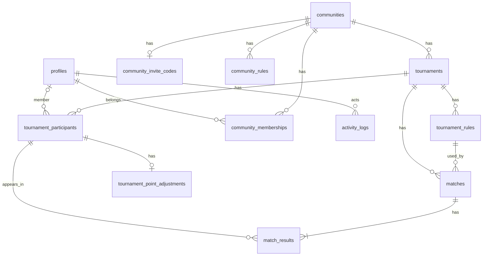

# 俺たちの雀歴 — ER 詳細

Phase 1-4 / 1-5。Phase 3 の migration の前提。SQL は書かない。

ドメイン（用語・保存方針・多重度・誰が何をできるか）の正は [overview.md](overview.md)。本ファイルは属性・制約・ER 図と、SELECT / INSERT / UPDATE / DELETE の判定経路。

---

## 識別子と型の方針

| 項目 | 方針 |
|------|------|
| 主キー | UUID |
| テーブル名 | 英語スネークケース（下表） |
| 日時 | 全テーブルに `created_at`（timestamptz, 必須）。行を更新しうるテーブルは `updated_at`（timestamptz, 必須）も付ける。例外: `community_memberships` は `joined_at` のみ。`activity_logs` と `community_invite_codes` は `created_at` のみ（差し替え・追記で、行の UPDATE は業務操作にしない） |
| **点数** | 整数（例: 25000） |
| **ポイント**・レート・大会修正ポイント | 小数（符号あり。PostgreSQL `numeric`。表示は小数第 1 位を想定するが、DB で桁は切らない） |
| 未使用の名称・タイトル | 空文字・空白のみは未使用（null と同じ）。`is_used` は持たない |
| 認証 | `auth.users` は Supabase Auth。アプリ側のユーザー実体は `profiles`。`profiles.id` は Auth と同一視しない。結びは `auth_user_id`（退会後は NULL） |

| エンティティ | テーブル識別子 |
|--------------|----------------|
| プロフィール | `profiles` |
| コミュニティ | `communities` |
| コミュニティメンバーシップ | `community_memberships` |
| コミュニティ既定ルール | `community_rules` |
| 麻雀大会 | `tournaments` |
| 大会ルール | `tournament_rules` |
| 大会参加者 | `tournament_participants` |
| 大会修正ポイント | `tournament_point_adjustments` |
| 試合 | `matches` |
| 試合結果 | `match_results` |
| 招待コード | `community_invite_codes` |
| 操作ログ（監査。UI 非表示） | `activity_logs` |

---

## ER 図

---

## プロフィール `profiles`

| 属性 | 識別子 | 型 | 必須 | 制約・備考 |
|------|--------|----|------|------------|
| ID | `id` | UUID | ✓ | アプリ側の人の ID。生涯不変。`auth.users.id` とは別 |
| Auth | `auth_user_id` | UUID | 条件 | ログイン中のみ。UNIQUE。Auth 削除時は NULL（墓石）。出鱈目な値は使わない |
| 表示名 | `display_name` | 文字列 | ✓ | メンバーが大会に出るときの名前。退会後は「退会済みユーザ」。コミュニティ別ニックネームは MVP 外 |
| コメント | `comment` | 文字列 | — | 自己紹介。空なら未設定。退会後は空にする |
| アイコン | `avatar_url` | 文字列 | — | Google / LINE ログイン時に Auth の `user_metadata.avatar_url` をコピー。メール登録は空。空なら頭文字を出す。アプリからのアップロードはしない。退会後は空 |
| 退会日時 | `withdrawn_at` | timestamptz | — | 入っていれば墓石。ログイン不可 |
| 作成日時 | `created_at` | timestamptz | ✓ | |
| 更新日時 | `updated_at` | timestamptz | ✓ | 表示名・コメントの変更など |

- 利用中: `auth_user_id` ありかつ `withdrawn_at` は空
- 退会（墓石）: 行は残す。`auth_user_id` を NULL、`withdrawn_at` を入れる、表示名を「退会済みユーザ」にする、コメントと `avatar_url` は空にする。`auth.users` は消す（Auth 削除で profiles を CASCADE しない）
- 再登録は新しい `profiles`（別人）。墓石とはつなげない
- Auth への FK を張るなら `auth_user_id` → `auth.users` の ON DELETE SET NULL。`id` には張らない

## コミュニティ `communities`

| 属性 | 識別子 | 型 | 必須 | 制約・備考 |
|------|--------|----|------|------------|
| ID | `id` | UUID | ✓ | |
| 名称 | `name` | 文字列 | ✓ | |
| コメント | `comment` | 文字列 | — | コミュニティの説明。空なら未設定 |
| 作成日時 | `created_at` | timestamptz | ✓ | |
| 更新日時 | `updated_at` | timestamptz | ✓ | |

## コミュニティメンバーシップ `community_memberships`

| 属性 | 識別子 | 型 | 必須 | 制約・備考 |
|------|--------|----|------|------------|
| ID | `id` | UUID | ✓ | |
| コミュニティ | `community_id` | UUID | ✓ | FK → `communities` |
| ユーザー | `user_id` | UUID | ✓ | FK → `profiles` |
| 参加日時 | `joined_at` | timestamptz | ✓ | 作成日時を兼ねる。`created_at` / `updated_at` は持たない |

- UNIQUE (`community_id`, `user_id`)
- **役割カラムは持たない**（全員同等。Phase 1-5）
- 退会・離脱・除名でこの行は消える。`profiles` は消さない（墓石または利用中のまま）

## ルール共通属性

`community_rules` と `tournament_rules` で同じ列を持つ。親 FK だけが違う。コピー元への参照は持たない（値の複製）。

| 属性 | 識別子 | 型 | 必須 | 制約・備考 |
|------|--------|----|------|------------|
| ID | `id` | UUID | ✓ | |
| 表示名 | `name` | 文字列 | ✓ | 同一親の中で UNIQUE（「四麻標準」「三麻」など） |
| 人数 | `player_count` | 整数 | ✓ | `3` または `4` |
| 持ち点 | `starting_score` | 整数 | ✓ | 点数 |
| 返し点 | `return_score` | 整数 | ✓ | 点数 |
| オカの同着時 | `oka_tie_handling` | 列挙 | ✓ | `kamicha`（上家取り）/ `split`（折半）/ `manual`（手動）。同着は **点数** の同着（順位付けの前）。上家取りは家の順（東→南→西→北）。`manual` のときは `match_results.base_points` を手入力 |
| ウマの有無 | `uma_enabled` | 真偽 | ✓ | `false` のとき以下のウマ列は NULL |
| ウマの同着時 | `uma_tie_handling` | 列挙 | 条件 | `kamicha`（上家取り）/ `split`（折半）/ `manual`（手動）。ウマありのとき必須。同着は **基本ポイント**（試合順位）の同着。上家取りは家の順（東→南→西→北） |
| ウマのポイント1 | `uma_points_1` | 整数 | 条件 | 最上位 ⇔ 最下位。ウマありのとき必須 |
| ウマのポイント2 | `uma_points_2` | 整数 | 条件 | 2位 ⇔ 3位。ウマありかつ四麻のとき必須。それ以外は NULL |
| トビの有無 | `tobi_enabled` | 真偽 | ✓ | |
| 焼き鳥の有無 | `yakitori_enabled` | 真偽 | ✓ | ありのとき、実際のポイントは試合で手入力 |
| その他ポイント1〜5の名称 | `other_points_1_name` … `other_points_5_name` | 文字列 | — | 例: 役満ご祝儀。空ならその枠は未使用 |
| レート | `rate` | 小数 | ✓ | 0 以上。ポイント計算の係数 |
| メモ | `notes` | 文字列 | — | ハウスルール等。計算には使わない |
| 作成日時 | `created_at` | timestamptz | ✓ | |
| 更新日時 | `updated_at` | timestamptz | ✓ | |

- `community_rules.community_id` → `communities`（必須）
- `tournament_rules.tournament_id` → `tournaments`（必須）
- UNIQUE (`community_id`, `name`) / UNIQUE (`tournament_id`, `name`)
- 大会作成時、コミュニティ既定を **値コピー** して大会ルールを作る。既定が 0 件なら大会ルールも 0 件で始まり、あとから追加できる
- 試合は大会ルールを 1 つ必須とする。ルール 0 件の大会では試合を作れない
- 1 件でも試合が紐づいた大会ルールは **修正不可**（アプリ制約。Phase 3 で trigger 可）。未使用の大会ルールとコミュニティ既定は修正できる

## 麻雀大会 `tournaments`

| 属性 | 識別子 | 型 | 必須 | 制約・備考 |
|------|--------|----|------|------------|
| ID | `id` | UUID | ✓ | |
| コミュニティ | `community_id` | UUID | ✓ | FK → `communities` |
| 日付 | `held_on` | date | ✓ | 開催日。時刻は持たない |
| 大会名 | `name` | 文字列 | ✓ | 同一コミュニティ内の重複は許す |
| 大会修正ポイント1〜5のタイトル | `adjustment_points_1_title` … `adjustment_points_5_title` | 文字列 | — | 例: チップ、会場優遇。空ならその枠は未使用 |
| メモ | `memo` | 文字列 | — | |
| 作成日時 | `created_at` | timestamptz | ✓ | |
| 更新日時 | `updated_at` | timestamptz | ✓ | |

最終順位・最終ポイントは **列にしない**（都度集計）。写真は MVP 外。

## 大会参加者 `tournament_participants`

| 属性 | 識別子 | 型 | 必須 | 制約・備考 |
|------|--------|----|------|------------|
| ID | `id` | UUID | ✓ | |
| 大会 | `tournament_id` | UUID | ✓ | FK → `tournaments` |
| ユーザー | `user_id` | UUID | 条件 | メンバーのとき必須。FK → `profiles` |
| ゲスト表示名 | `guest_display_name` | 文字列 | 条件 | ゲストのとき必須。空文字不可 |
| 作成日時 | `created_at` | timestamptz | ✓ | |
| 更新日時 | `updated_at` | timestamptz | ✓ | |

- XOR: `user_id` と `guest_display_name` のどちらか一方のみ
- UNIQUE (`tournament_id`, `user_id`) WHERE `user_id` IS NOT NULL
- UNIQUE (`tournament_id`, `guest_display_name`) WHERE `guest_display_name` IS NOT NULL（同一大会のゲスト同名は不可）
- **新たに** メンバーとして載せるとき、その `user_id` は当該コミュニティの **現メンバー**（墓石でない）であること
- 既存行は、離脱・除名・退会後も `user_id` を残してよい。ゲストへ載せ替えない。離脱・除名後の表示は現行の `profiles.display_name`。退会後は墓石の「退会済みユーザ」
- コミュニティ所属者をゲストとして載せる二重登録はしない（アプリ制約。XOR だけでは検知しない）
- 試合に出すには、先にこのリストへ載せる

## 大会修正ポイント `tournament_point_adjustments`

| 属性 | 識別子 | 型 | 必須 | 制約・備考 |
|------|--------|----|------|------------|
| ID | `id` | UUID | ✓ | |
| 大会参加者 | `tournament_participant_id` | UUID | ✓ | FK → `tournament_participants`。UNIQUE（参加者あたり最大 1 行） |
| 修正ポイント1〜5 | `adjustment_points_1` … `adjustment_points_5` | 小数 | ✓ | 大会の同番号のタイトルに対応。タイトルが空なら 0。手入力 |
| 作成日時 | `created_at` | timestamptz | ✓ | |
| 更新日時 | `updated_at` | timestamptz | ✓ | |

- 行が無い参加者は、修正ポイントすべて 0 とみなす
- その人の大会修正ポイント = 1〜5 の合計
- ゼロサム制約なし
- 未出場者にも付けられる

## 試合 `matches`

| 属性 | 識別子 | 型 | 必須 | 制約・備考 |
|------|--------|----|------|------------|
| ID | `id` | UUID | ✓ | |
| 大会 | `tournament_id` | UUID | ✓ | FK → `tournaments` |
| 使用ルール | `tournament_rule_id` | UUID | ✓ | FK → `tournament_rules`。**同じ大会の**ルールであること |
| 試合個別ポイント1〜3のタイトル | `manual_points_1_title` … `manual_points_3_title` | 文字列 | — | この試合だけの手動枠。空ならその枠は未使用 |
| コメント | `comment` | 文字列 | — | 試合単位。プレイヤーごとではない |
| 作成日時 | `created_at` | timestamptz | ✓ | 試合一覧の並び。明示的な通し番号は持たない（並べ替え UI は Phase 2 以降で必要なら足す） |
| 更新日時 | `updated_at` | timestamptz | ✓ | |

## 試合結果 `match_results`

| 属性 | 識別子 | 型 | 必須 | 制約・備考 |
|------|--------|----|------|------------|
| ID | `id` | UUID | ✓ | |
| 試合 | `match_id` | UUID | ✓ | FK → `matches` |
| 大会参加者 | `tournament_participant_id` | UUID | ✓ | FK → `tournament_participants`。**同じ大会の**参加者であること |
| 家 | `seat` | 列挙 | ✓ | `east`（東家）/ `south`（南家）/ `west`（西家）/ `north`（北家）。四麻は 4 種を 1 回ずつ。三麻は `east` / `south` / `west`（`north` は使わない） |
| 点数 | `score` | 整数 | ✓ | 半荘終了時の持ち点。手入力 |
| 基本ポイント | `base_points` | 小数 | ✓ | 点数にオカのみを反映したポイント（レート・ウマ・トビ等は含まない）。自動計算、またはオカ同着が手動のとき手入力。オカ単体の列は持たない |
| ウマ | `uma_points` | 小数 | ✓ | ポイント内訳。ウマなしのときは 0 |
| トビ | `tobi_points` | 小数 | ✓ | ポイント内訳。トビなしのときは 0 |
| 焼き鳥 | `yakitori_points` | 小数 | ✓ | ポイント内訳。焼き鳥なしのときは 0。ありのときは手入力 |
| その他ポイント1〜5 | `other_points_1` … `other_points_5` | 小数 | ✓ | ルールの同番号の名称に対応。名称が空なら 0。手入力 |
| 試合個別ポイント1〜3 | `manual_points_1` … `manual_points_3` | 小数 | ✓ | 試合の同番号のタイトルに対応。タイトルが空なら 0。手入力 |
| ポイント | `points` | 小数 | ✓ | この試合の合計。大会集計の正。基本ポイントにウマ・トビ等とレートを加味する |
| 順位 | `rank` | 整数 | ✓ | **基本ポイント**の高い順で保存時に計算。1 以上。同ポイントは同位で次を飛ばす（1, 2, 2, 4）。オカの上家取りは基本ポイントに入るため順位が分かれうる。ウマの上家取りは順位を分けない。上家は家の順（東→南→西→北） |
| 作成日時 | `created_at` | timestamptz | ✓ | |
| 更新日時 | `updated_at` | timestamptz | ✓ | |

- UNIQUE (`match_id`, `tournament_participant_id`)
- UNIQUE (`match_id`, `seat`)
- 1 試合の結果件数は、使用ルールの `player_count`（3 または 4）と一致（アプリ制約）
- 三麻で `north` を使うことは不可（アプリ制約）
- 点数合計が「持ち点 × 人数」と一致する **DB 制約は持たない**（変則や入力中を許容。画面の警告は Phase 2）
- 内訳（基本ポイント + ウマ + トビ + 焼き鳥 + その他 + 試合個別）と `points` の関係（レートの掛け方を含む）は計算式とともに Phase 2〜4。ポイント合計のゼロサム制約は持たない

---

## 招待コード `community_invite_codes`

| 属性 | 識別子 | 型 | 必須 | 制約・備考 |
|------|--------|----|------|------------|
| ID | `id` | UUID | ✓ | |
| コミュニティ | `community_id` | UUID | ✓ | FK → `communities`。UNIQUE（コミュニティあたり最大 1 行） |
| コード | `code` | 文字列 | ✓ | コミュニティ横断で UNIQUE。参加時の入力値 |
| 有効期限 | `expires_at` | timestamptz | ✓ | この時点以降は参加に使えない |
| 作成者 | `created_by` | UUID | ✓ | 発行したメンバー（`profiles.id`）。所有関係ではないので図には描かない。退会後も墓石を指したまま |
| 作成日時 | `created_at` | timestamptz | ✓ | 再発行したら作り直す |

- 所有はコミュニティ（`community_id`）のみ。`created_by` は属性であり、ER 図のリレーションにはしない
- 再発行は旧行を消して新しい行を入れる（差し替え）。旧コードは無効。期限だけ延ばす操作は持たない（再発行する）
- アプリの業務操作としては行の UPDATE は使わない（RLS 上 UPDATE を許可しても、再発行は差し替え）
- 期限切れまで何度でも使える。使用回数の上限は持たない
- 未所属者はこの表を SELECT できない
- 参加はコードを引数にする関数（Phase 3）。未所属者が `community_memberships` へ直接 INSERT することは許可しない
- コードの文字種・長さは Phase 3

## 操作ログ `activity_logs`

アプリの UI には出さない。万が一のときに開発者が確認する監査テーブル。

| 属性 | 識別子 | 型 | 必須 | 制約・備考 |
|------|--------|----|------|------------|
| ID | `id` | UUID | ✓ | |
| 対象種別 | `entity_type` | 列挙 | ✓ | `community` / `tournament` / `match` |
| 対象 ID | `entity_id` | UUID | ✓ | 対象行の PK。ポリモーフィック（FK は張らない）。削除後も値は残す |
| 操作 | `action` | 列挙 | ✓ | `insert` / `update` / `delete` |
| 操作者 | `actor_user_id` | UUID | ✓ | FK → `profiles`。図上のリレーションはここだけ。退会後も墓石を指す（SET NULL しない） |
| 記録日時 | `created_at` | timestamptz | ✓ | |

- `community_id` は持たない（コミュニティとの FK なし。対象は `entity_type` + `entity_id`）
- 値の差分（変更前/後）は持たない
- 子の変更は親キーに寄せる。既定ルール・招待・メンバーシップ → コミュニティ ID。大会ルール・参加者・修正ポイント → 大会 ID。試合結果 → 試合 ID
- RLS: 認証済みユーザーは **INSERT のみ**。SELECT / UPDATE / DELETE は不可。開発者の確認は service role 等（RLS 外）
- コミュニティや対象行を消してもログは残す（CASCADE しない）
- `updated_at` は持たない（追記のみ）

## 削除方針（Phase 3 の FK 用）

基本は **RESTRICT**（参照が残っている間は親を消さない）。例外だけ CASCADE。

| 操作 | 方針 |
|------|------|
| 試合を消す | 試合結果は CASCADE |
| 大会参加者を消す | 試合結果がある間は RESTRICT。修正ポイント行は CASCADE |
| 大会ルールを消す | 試合が紐づいている間は RESTRICT |
| 大会を消す | 試合・参加者が残っている間は RESTRICT。アプリが子から消す |
| コミュニティの明示削除 | **空のときだけ**（大会 0 件かつ既定ルール 0 件）。そうでなければ RESTRICT。メンバーシップ・招待コードは CASCADE。操作ログは残す |
| 最後の 1 人の離脱 | コミュニティごと消す。大会・既定ルールが残っていても CASCADE（試合・参加者等も含む）。孤児を残さない |
| ユーザー退会 | `profiles` は消さない（墓石）。メンバーシップは全コミュニティ分削除（最後の 1 人なら上の離脱と同じ）。`auth.users` は消す |

---

## RLS 方針

Phase 3 の policy SQL の前提。要約は [overview.md の権限モデル](overview.md#権限モデルphase-1-5)。

コミュニティ配下は **`community_memberships` まで辿って**、呼び出し人の **利用中** プロフィール（`withdrawn_at` 空、`auth_user_id` あり）の行があるかで判定する。`user_id` を持たない表も同じ。大会に出ていなくても、所属していれば配下は読める・書ける。

**直接**: ユーザーセッションの Supabase クライアントによる `select` / `insert` / `update` / `delete`。

**関数**: Server Action から `supabase.rpc`（Postgres の SECURITY DEFINER 関数）。独自 REST は使わない。

「可」は、判定経路を満たせば直接操作してよい、の意味。追加条件があれば同じセルに書く。未ログインはすべて不可。墓石はログインできないので「呼び出し人のメンバーシップ」にはならない。

| テーブル | 判定経路 | SELECT | INSERT | UPDATE | DELETE |
|----------|----------|--------|--------|--------|--------|
| `profiles` | SELECT は次のいずれか。（1）この行の `auth_user_id` が呼び出し人。（2）`community_memberships` を共有する。（3）`tournament_participants.user_id` = この行の `id` かつ、その大会の `community_id` について呼び出し人のメンバーシップがある。UPDATE は (1) のみ | 可。所属メンバーは (2)。離脱・退会後の墓石は (3) のみ | 不可（Auth 登録時の trigger 等） | 可（表示名など）。墓石化は退会関数 | 不可（退会は墓石。行は残す） |
| `communities` | `community_memberships`（`community_id` = この行の `id`） | 可（所属しているコミュニティだけ） | 不可（作成関数が、コミュニティと自分のメンバーシップをまとめて作る） | 可 | 可、かつ **空**（大会 0 かつ既定ルール 0） |
| `community_memberships` | 同じ表（この行の `community_id` について、呼び出し人のメンバーシップがある） | 可（同じコミュニティのメンバー一覧。抜けた人の行は無い） | 不可（参加関数または作成関数） | 不可 | 可（自分の離脱・他人の除名）。**最後の 1 人**のときはコミュニティごと消す（関数または trigger。空でないコミュニティの直接 DELETE は使わない） |
| `community_rules` | `community_memberships`（この行の `community_id`） | 可 | 可 | 可 | 可 |
| `community_invite_codes` | `community_memberships`（この行の `community_id`） | 可。**未所属者は不可**（参加はコードを渡す関数） | 可 | 可（実装都合。業務操作の再発行は差し替え） | 可 |
| `tournaments` | `community_memberships`（この行の `community_id`） | 可 | 可 | 可 | 可。試合・参加者が残っている間は FK で RESTRICT（子から消す） |
| `tournament_rules` | `tournaments`（`tournament_id`）→ `community_memberships`（大会の `community_id`） | 可 | 可 | 可。**試合が 1 件でも紐づいていれば不可**（trigger 等） | 可。試合が紐づいている間は RESTRICT |
| `tournament_participants` | `tournaments`（`tournament_id`）→ `community_memberships`（大会の `community_id`） | 可 | 可。`user_id` を付けるならその人は当該コミュニティの **現メンバー**（墓石不可）。ゲストは表示名 | 可。`user_id` を付ける／変える場合も現メンバーであること | 可。試合結果がある間は RESTRICT |
| `tournament_point_adjustments` | `tournament_participants` → `tournaments` → `community_memberships`（大会の `community_id`） | 可 | 可 | 可 | 可 |
| `matches` | `tournaments`（`tournament_id`）→ `community_memberships`（大会の `community_id`） | 可 | 可 | 可 | 可（試合結果は CASCADE） |
| `match_results` | `matches` → `tournaments` → `community_memberships`（大会の `community_id`） | 可 | 可 | 可 | 可 |
| `activity_logs` | コミュニティは見ない。INSERT は認証済み。SELECT はアプリロールでは不可 | **不可**。開発者は service role 等（RLS 外） | 可。`actor_user_id` は呼び出し人のプロフィール | 不可 | 不可 |

`profiles` の SELECT (3) は、所属が切れたあとも対局の名前を出すため。

関数にまとめる操作:

| 関数（名前は Phase 3） | 内容 |
|------------------------|------|
| コミュニティ作成 | `communities` INSERT + 自分の `community_memberships` INSERT |
| コミュニティ参加 | 招待コードを検証し、自分の `community_memberships` INSERT。既所属なら何もしない |
| アプリ退会 | 墓石（匿名化、`auth_user_id` NULL、`withdrawn_at`）。全コミュニティから離脱（最後の 1 人ならコミュニティ削除）。続けて Auth Admin で `auth.users` 削除 |

---

## 扱わないもの（MVP）

ドメイン側の一覧は [overview.md の MVP スコープ](overview.md#mvp-スコープ)。スキーマに載せないもの:

- 局単位の記録、アガリ役・詳細な和了情報
- 写真のアップロード
- コミュニティ別ニックネーム、ゲストの名寄せ
- 公開ルーム
- 通算成績・統計用の集計テーブル
- 操作ログの値差分、`community_id`
