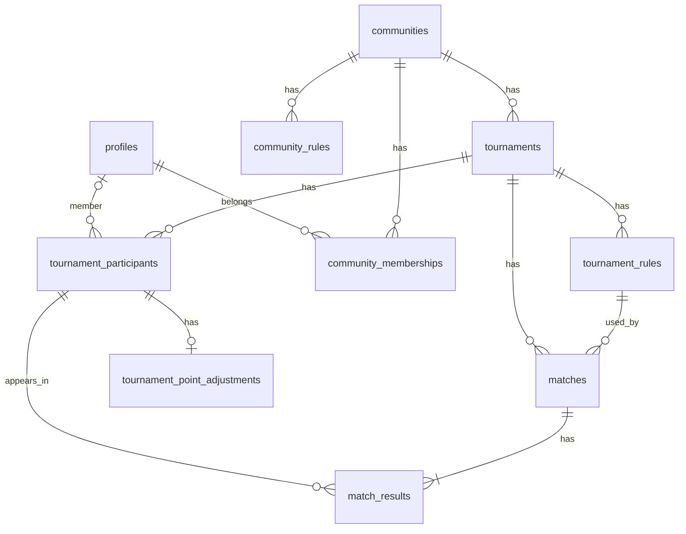

# 俺たちの雀歴 — ER 詳細

Phase 1-4。Phase 3 の migration の前提。SQL は書かない。

用語・保存方針・多重度の正は [overview.md](overview.md)。役割・招待・RLS の書き込み粒度は 1-5。

---

## 識別子と型の方針

| 項目 | 方針 |
|------|------|
| 主キー | UUID |
| テーブル名 | 英語スネークケース（下表） |
| 日時 | 全エンティティに `created_at`。更新しうるものは `updated_at`。メンバーシップは `joined_at` を作成日時とする |
| **点数** | 整数（例: 25000） |
| **ポイント**・レート・大会修正ポイント | 小数（符号あり。PostgreSQL `numeric`。表示は小数第 1 位を想定するが、DB で桁は切らない） |
| 未使用の名称・タイトル | 空文字・空白のみは未使用（null と同じ）。`is_used` は持たない |
| 認証 | `auth.users` は Supabase Auth。アプリ側のユーザー実体は `profiles`（`id` = `auth.users.id`） |

| エンティティ | テーブル識別子 |
|--------------|----------------|
| プロフィール | `profiles` |
| コミュニティ | `communities` |
| コミュニティメンバーシップ | `community_memberships` |
| コミュニティ既定ルール | `community_rules` |
| 麻雀大会 | `tournaments` |
| 大会ルール | `tournament_rules` |
| 大会参加者 | `tournament_participants` |
| 大会修正ポイント | `tournament_point_adjustments` |
| 試合 | `matches` |
| 試合結果 | `match_results` |

---

## ER 図

---

## プロフィール `profiles`

| 属性 | 識別子 | 型 | 必須 | 制約・備考 |
|------|--------|----|------|------------|
| ID | `id` | UUID | ✓ | `auth.users.id` と同一 |
| 表示名 | `display_name` | 文字列 | ✓ | メンバーが大会に出るときの名前。コミュニティ別ニックネームは MVP 外 |

## コミュニティ `communities`

| 属性 | 識別子 | 型 | 必須 | 制約・備考 |
|------|--------|----|------|------------|
| ID | `id` | UUID | ✓ | |
| 名称 | `name` | 文字列 | ✓ | |

## コミュニティメンバーシップ `community_memberships`

| 属性 | 識別子 | 型 | 必須 | 制約・備考 |
|------|--------|----|------|------------|
| ID | `id` | UUID | ✓ | |
| コミュニティ | `community_id` | UUID | ✓ | FK → `communities` |
| ユーザー | `user_id` | UUID | ✓ | FK → `profiles` |
| 参加日時 | `joined_at` | timestamptz | ✓ | |

- UNIQUE (`community_id`, `user_id`)
- **役割カラムは持たない**（1-5）

## ルール共通属性

`community_rules` と `tournament_rules` で同じ列を持つ。親 FK だけが違う。コピー元への参照は持たない（値の複製）。

| 属性 | 識別子 | 型 | 必須 | 制約・備考 |
|------|--------|----|------|------------|
| ID | `id` | UUID | ✓ | |
| 表示名 | `name` | 文字列 | ✓ | 同一親の中で UNIQUE（「四麻標準」「三麻」など） |
| 人数 | `player_count` | 整数 | ✓ | `3` または `4` |
| 持ち点 | `starting_score` | 整数 | ✓ | 点数 |
| 返し点 | `return_score` | 整数 | ✓ | 点数 |
| オカの同着時 | `oka_tie_handling` | 列挙 | ✓ | `kamicha`（上家取り）/ `split`（折半）/ `manual`（手動）。同着は点数（試合順位）の同着 |
| ウマの有無 | `uma_enabled` | 真偽 | ✓ | `false` のとき以下のウマ列は NULL |
| ウマの同着時 | `uma_tie_handling` | 列挙 | 条件 | `kamicha`（上家取り）/ `split`（折半）/ `manual`（手動）。ウマありのとき必須。同着は点数（試合順位）の同着 |
| ウマのポイント1 | `uma_points_1` | 整数 | 条件 | 最上位 ⇔ 最下位。ウマありのとき必須 |
| ウマのポイント2 | `uma_points_2` | 整数 | 条件 | 2位 ⇔ 3位。ウマありかつ四麻のとき必須。それ以外は NULL |
| トビの有無 | `tobi_enabled` | 真偽 | ✓ | |
| 焼き鳥の有無 | `yakitori_enabled` | 真偽 | ✓ | ありのとき、実際のポイントは試合で手入力 |
| その他ポイント1〜5の名称 | `other_points_1_name` … `other_points_5_name` | 文字列 | — | 例: 役満ご祝儀。空ならその枠は未使用 |
| レート | `rate` | 小数 | ✓ | 0 以上。ポイント計算の係数 |
| メモ | `notes` | 文字列 | — | ハウスルール等。計算には使わない |

- `community_rules.community_id` → `communities`（必須）
- `tournament_rules.tournament_id` → `tournaments`（必須）
- UNIQUE (`community_id`, `name`) / UNIQUE (`tournament_id`, `name`)
- 大会作成時、コミュニティ既定を **値コピー** して大会ルールを作る。既定が 0 件なら大会ルールも 0 件で始まり、あとから追加できる
- 1 件でも試合が紐づいた大会ルールは **修正不可**（アプリ制約。Phase 3 で trigger 可）。未使用の大会ルールとコミュニティ既定は修正できる

## 麻雀大会 `tournaments`

| 属性 | 識別子 | 型 | 必須 | 制約・備考 |
|------|--------|----|------|------------|
| ID | `id` | UUID | ✓ | |
| コミュニティ | `community_id` | UUID | ✓ | FK → `communities` |
| 日付 | `held_on` | date | ✓ | 開催日。時刻は持たない |
| 大会名 | `name` | 文字列 | ✓ | 同一コミュニティ内の重複は許す |
| 大会修正ポイント1〜5のタイトル | `adjustment_points_1_title` … `adjustment_points_5_title` | 文字列 | — | 例: チップ、会場優遇。空ならその枠は未使用 |
| メモ | `memo` | 文字列 | — | |

最終順位・最終ポイントは **列にしない**（都度集計）。写真は MVP 外。

## 大会参加者 `tournament_participants`

| 属性 | 識別子 | 型 | 必須 | 制約・備考 |
|------|--------|----|------|------------|
| ID | `id` | UUID | ✓ | |
| 大会 | `tournament_id` | UUID | ✓ | FK → `tournaments` |
| ユーザー | `user_id` | UUID | 条件 | メンバーのとき必須。FK → `profiles` |
| ゲスト表示名 | `guest_display_name` | 文字列 | 条件 | ゲストのとき必須。空文字不可 |

- XOR: `user_id` と `guest_display_name` のどちらか一方のみ
- UNIQUE (`tournament_id`, `user_id`) WHERE `user_id` IS NOT NULL
- UNIQUE (`tournament_id`, `guest_display_name`) WHERE `guest_display_name` IS NOT NULL
- メンバーの `user_id` は、その大会のコミュニティのメンバーであること（アプリ制約）
- 試合に出すには、先にこのリストへ載せる

## 大会修正ポイント `tournament_point_adjustments`

| 属性 | 識別子 | 型 | 必須 | 制約・備考 |
|------|--------|----|------|------------|
| ID | `id` | UUID | ✓ | |
| 大会参加者 | `tournament_participant_id` | UUID | ✓ | FK → `tournament_participants`。UNIQUE（参加者あたり最大 1 行） |
| 修正ポイント1〜5 | `adjustment_points_1` … `adjustment_points_5` | 小数 | ✓ | 大会の同番号のタイトルに対応。タイトルが空なら 0。手入力 |

- 行が無い参加者は、修正ポイントすべて 0 とみなす
- その人の大会修正ポイント = 1〜5 の合計
- ゼロサム制約なし
- 未出場者にも付けられる

## 試合 `matches`

| 属性 | 識別子 | 型 | 必須 | 制約・備考 |
|------|--------|----|------|------------|
| ID | `id` | UUID | ✓ | |
| 大会 | `tournament_id` | UUID | ✓ | FK → `tournaments` |
| 使用ルール | `tournament_rule_id` | UUID | ✓ | FK → `tournament_rules`。**同じ大会の**ルールであること |
| 試合個別ポイント1〜3のタイトル | `manual_points_1_title` … `manual_points_3_title` | 文字列 | — | この試合だけの手動枠。空ならその枠は未使用 |
| コメント | `comment` | 文字列 | — | 試合単位。プレイヤーごとではない |

並びは `created_at`。明示的な通し番号は持たない（並べ替え UI は Phase 2 以降で必要なら足す）。

## 試合結果 `match_results`

| 属性 | 識別子 | 型 | 必須 | 制約・備考 |
|------|--------|----|------|------------|
| ID | `id` | UUID | ✓ | |
| 試合 | `match_id` | UUID | ✓ | FK → `matches` |
| 大会参加者 | `tournament_participant_id` | UUID | ✓ | FK → `tournament_participants`。**同じ大会の**参加者であること |
| 点数 | `score` | 整数 | ✓ | 半荘終了時の持ち点。手入力 |
| オカ | `oka_points` | 小数 | ✓ | ポイント内訳。自動計算または手動 |
| ウマ | `uma_points` | 小数 | ✓ | ポイント内訳。ウマなしのときは 0 |
| トビ | `tobi_points` | 小数 | ✓ | ポイント内訳。トビなしのときは 0 |
| 焼き鳥 | `yakitori_points` | 小数 | ✓ | ポイント内訳。焼き鳥なしのときは 0。ありのときは手入力 |
| その他ポイント1〜5 | `other_points_1` … `other_points_5` | 小数 | ✓ | ルールの同番号の名称に対応。名称が空なら 0。手入力 |
| 試合個別ポイント1〜3 | `manual_points_1` … `manual_points_3` | 小数 | ✓ | 試合の同番号のタイトルに対応。タイトルが空なら 0。手入力 |
| ポイント | `points` | 小数 | ✓ | この試合の合計。大会集計の正。レートはルールの係数としてここに反映 |
| 順位 | `rank` | 整数 | ✓ | **点数**の高い順で保存時に計算。1 以上。同点は同位で次を飛ばす（1, 2, 2, 4）。上家取りはオカ・ウマの配分に使い、順位は分けない |

- UNIQUE (`match_id`, `tournament_participant_id`)
- 1 試合の結果件数は、使用ルールの `player_count`（3 または 4）と一致（アプリ制約）
- 点数合計が「持ち点 × 人数」と一致する **DB 制約は持たない**（変則や入力中を許容。画面の警告は Phase 2）
- 内訳の合計と `points` の関係（レートの掛け方を含む）は計算式とともに Phase 2〜4。ポイント合計のゼロサム制約は持たない

---

## 削除方針（Phase 3 の FK 用）

基本は **RESTRICT**（参照が残っている間は親を消さない）。例外だけ CASCADE。

| 操作 | 方針 |
|------|------|
| 試合を消す | 試合結果は CASCADE |
| 大会参加者を消す | 試合結果がある間は RESTRICT。修正ポイント行は CASCADE |
| 大会ルールを消す | 試合が紐づいている間は RESTRICT |
| 大会を消す | 試合・参加者が残っている間は RESTRICT。アプリが子から消す |
| コミュニティを消す | 大会・既定ルール・メンバーシップが残っている間は RESTRICT。詳細な権限は 1-5 |

---

## 1-5 に送るもの

- メンバーの役割（作成者・管理者を置くか）
- 招待のデータの持ち方
- RLS（誰が何を読める / 書けるか。コミュニティ配下への伝播）

## 扱わないもの（MVP）

- 局単位の記録
- アガリ役・詳細な和了情報
- 写真のアップロード
- コミュニティ別ニックネーム、ゲストの名寄せ
