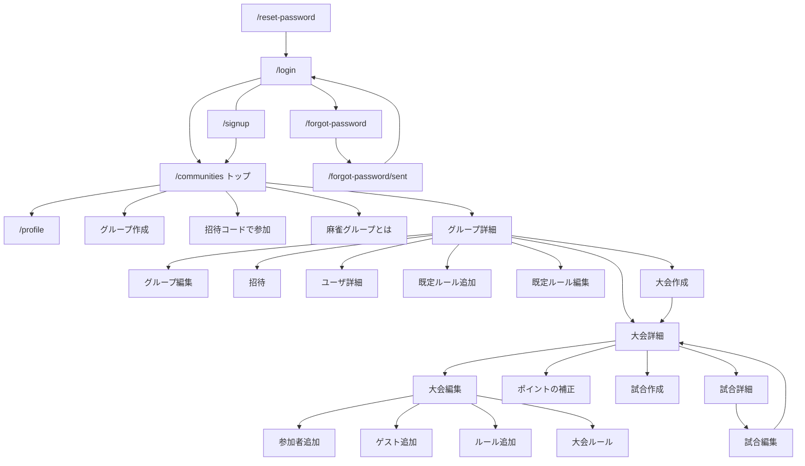

# 俺たちの雀歴 — UI 仕様

UI の正（画面遷移・部品・トークン・基本フロー外の方針）。見た目の正は `web/` のモック。ドメインの正は [overview.md](overview.md)。属性・制約・RLS は [er.md](er.md)。進捗は [status.md](status.md)。

Phase 4 の見た目はモックと本ファイルを正とする。コンポーネント分割と計算の置き場は再整理する（[tasks.md の Phase 4](tasks.md#phase-4-mvp-実装)）。データ方針は変えない。

---

## 文書の役割

| 見るもの | 正 |
|----------|----|
| 用語・保存 vs 計算・誰が何をできるか | [overview.md](overview.md) |
| 属性・制約・ER | [er.md](er.md) |
| 画面の配置・遷移・文言・トーン | 本ファイル + `web/` のモック |
| コンポーネント分割・クラスの置き場 | `web/src/components/ui/`（クラスは `classes.ts`）。`MatchForm` / `RuleForm` の内部は `match-form/` / `rule-form/`。見た目はモック + 本ファイル |
| ピクセル完全再現 | しない。迷う点は本ファイル、見た目の感覚はモック |

モックはダミーデータで、入力は見せるだけで保存しない。Phase 4 で保存する。

---

## 原則

- **言語**: 日本語のみ。アプリ名は **俺たちの雀歴**
- **媒体**: スマートフォン優先。基準幅は 375px。PC は妥協可（`MockShell` の `max-w-md` 相当）
- **麻雀グループ**: 最上位の集まり。用語の正は [overview.md](overview.md)
- **対局記録専用**: 点数・基本ポイント・ポイントのみ。「金額」は出さない。「レート」はポイント計算の係数
- **認証**: ほぼ全ページでログイン必須。未ログインはログインへ
- **権限**: 所属メンバーは全員同等。画面上も管理者ラベルは持たない

---

## UI 用語

| UI の語 | 意味 |
|---------|------|
| 麻雀グループ | 麻雀仲間の単位。識別子は `communities` |
| 点数 / 素点 | 半荘終了時の持ち点 |
| 基本pt | 点数にオカを反映した基本ポイント |
| 合計pt | ウマ・トビ等を加味した、レート前のポイント |
| 反映pt | 合計pt × レート。試合のポイント |
| 試合pt | 大会補正画面での、試合ポイント合計 |
| pt | ポイントの略。画面上はこちらを優先 |
| 家 | 東家・南家・西家・北家 |
| 既定ルール | 麻雀グループのテンプレート |
| ゲスト参加者 | アカウントのない人。大会ごとの表示名 |

---

## レイアウトとトーン

本採用は 2-7。色の土台は **雀卓**。構成は **カード枠**。

- ページ背景 `page`、コンテンツ幅は `surface` のカラム（最大 `max-w-md`）
- ヘッダーは sticky。戻る＋中央タイトル＋右アクション
- 本文フォントは **Noto Sans JP**（`next/font` で自己ホスト。400 / 500）
- 入力欄は白背景（`field`）
- ラジオ・チェックは墨（`ink`）
- 危険色のトークンは持たない。確認ダイアログの実行ボタンもアクセント色

---

## デザイントークン

定義の正は `web/src/app/globals.css` の `@theme`。Tailwind では `bg-page` / `text-ink` / `h-header` のように使う。

| トークン | 値 | 用途 |
|----------|-----|------|
| `page` | `#d7e3d6` | 画面外の余白 |
| `surface` | `#f4efe4` | コンテンツ背景 |
| `ink` | `#1a2e24` | 本文 |
| `muted` | `#4a5c54` | 補足・破壊的操作の文字ボタン |
| `line` | `#c5d0c8` | 枠線・区切り |
| `header` | `#1f5c45` | ヘッダー背景 |
| `header-fg` | `#faf6ee` | ヘッダー文字 |
| `accent` | `#1f5c45` | 主ボタン |
| `accent-fg` | `#faf6ee` | 主ボタン文字 |
| `subtle` | `#e4ddd0` | アイコンの地 |
| `field` | `#ffffff` | 入力欄 |
| `radius-ui` | `4px` | 角丸 |
| `spacing-header` | `3.6rem` | ヘッダー高さ |
| `spacing-header-btn` | `2.1rem` | ヘッダー内ボタンの最小高さ |
| `spacing-header-icon` | `2.52rem` | ヘッダーの戻る・ホームアイコンボタン（`header-btn` の 1.2 倍） |
| `font-sans` | Noto Sans JP 400 / 500 | 本文・見出し。`next/font` の `--font-noto-sans-jp` |
| `text-heading` | `1.2rem` / 行高 1.3 | ヘッダータイトル、トップの表示名 |

クラス定義の正は `web/src/components/ui/classes.ts`（`@/components/ui` から re-export）。

| クラス | 用途 |
|--------|------|
| `fieldClass` | 1 行入力 |
| `searchFieldClass` | 検索 |
| `textareaClass` | 複数行。既定行数は `TEXTAREA_ROWS` = 3 |
| `labelClass` | フィールドラベル（`text-sm`） |
| `gridLabelClass` | 試合入力テーブルの行ラベル（`text-xs` / `muted`） |
| `cellInputClass` | 試合入力の数値セル |
| `cellSelectClass` | 試合入力の参加者セレクト |
| `cellTitleClass` | 試合個別ptのタイトル |
| `rowTitleClass` | 一覧行の主テキスト |
| `pressableClass` | ごく薄い影。タップで 1px 沈む |
| `pressableStrongClass` | 主ボタン用の少し濃い影 |
| `compactButtonClass` | 小さいボタン（追加・編集） |
| `headerIconButtonClass` | ヘッダーのアイコンボタン（戻る・ホーム） |
| `blockButtonClass` | 主ボタン（保存する、等） |
| `outlineBlockButtonClass` | 枠線の全幅ボタン（OAuth、コピー） |

カード内の小さいボタンはヘッダーボタンより小さい。実機確認済みで問題なし。無効時の文字ボタンは `disabled:text-line`。

---

## 共通パターン

### ナビゲーション

**戻る＋タイトルを本採用**（戻るとホームはアイコン）。タブもハンバーガーも持たない。

- 左: 「戻る」アイコン（直前の一覧・詳細へ）。トップとログインは戻るなし。戻るがあるログイン中の画面は、その右に「ホーム」アイコン（トップ `/communities` へ。未保存の確認は出さない）
- 中央: 画面タイトル（長いときは truncate）
- 右: その画面の主アクション（編集、修正）。無いときは空
- 戻るとホームはアイコンのみ（`aria-label` は「戻る」「ホーム」）。ログイン／アカウント作成／パスワード再設定にはホームを出さない

ブラウザの履歴バックに頼らない。`backHref` を明示する。

### カード枠と一覧

- まとまりは `SectionCard`（枠線、見出し、見出し右のアクション）
- 詳細・編集を持つ明細の一覧は **行タップ＋シェブロン**（`RowLink`）。行はナビゲーション専用
- カード内の一覧がカードの最後の要素なら `border-t`（最下行の下は引かない）
- 下に別要素が続くときだけ `border-y`（例: トップの麻雀グループ一覧の下に「招待コードで参加」）
- 見出し右の「追加」がある一覧は、空のとき **空メッセージを出さない**
- 説明文はカードの外・一覧の下

### ボタン

- 主操作: 全幅の塗りボタン（作成する / 保存する / 追加する）
- 副操作: 枠線の全幅、または見出し右の小さいボタン
- 破壊的操作: 画面最下部の文字ボタン。色は `muted`

### 入力

- ラベルはフィールドの上。共通部品は `Field`
- 日付は表示が `YYYY/MM/DD`、入力は `type="date"`
- 開催日などの表示は `N年N月N日`
- ポイント表示は符号付き小数 1 桁（例: `+12.0`、`-4.5`）
- 試合入力のトビ・焼き鳥・その他ポイント・試合個別pt・手動ウマは、値が 0 のとき空欄。空は 0 として計算する

### 破壊的操作

詳細・編集画面を持つ明細は、削除をその画面の最下部に置く。スワイプ削除・一覧の編集モードは採らない。まとめて削除が要る一覧が出たら、そのときに編集モードを検討する。

共通部品は `DangerAction`。

| 対象 | 置く画面 | 実行ラベル |
|------|----------|------------|
| 大会 | 大会編集 | この大会を削除する |
| 試合 | 試合編集 | この試合を削除する |
| 既定ルール | ルール編集 | このルールを削除する |
| 大会ルール | ルール編集 / 閲覧 | このルールを削除する |
| アプリ退会 | プロフィール編集 | アプリを退会する |
| 麻雀グループを抜ける | 麻雀グループ編集 | この麻雀グループを抜ける |
| 除名 | 他人のユーザ詳細 | このメンバーを外す（方針。モック未実装） |

削除できないもの（試合で使用中の大会ルール）はボタンを無効にし、理由を一文添える。

フォーム内の参加者・ゲストは削除ではなく選択解除なので、行右端の「外す」を維持する。確認ダイアログは出さない。

確認ダイアログ:

- 共通部品は `ConfirmDialog`（`DangerAction` と点数合計のずれが使う）
- 実行ボタン（アクセント）／「キャンセル」
- 危険色は使わない
- フォーカストラップ・背景スクロール固定

### ポイント表記

画面上は **pt**。基本ポイントは **基本pt**。試合のポイント（レート後）は **反映pt**。大会の最終値は総合順位の右端（符号付き pt）。

---

## 共通部品

置き場は `web/src/components/`。`ui/` は薄い共通部品。`MatchForm` / `RuleForm` の公開 API は従来どおりで、内部は `match-form/` / `rule-form/`。

| 部品 | 置き場 | 役割 |
|------|--------|------|
| `Field` | `ui/` | ラベル＋子。1 行入力・複数行 |
| `RadioRow` / `RadioOption` | `ui/` | ラジオの fieldset と選択肢 |
| `CellInput` / `CellRead` / `CellSelect` / `GridRow` | `ui/` | 試合入力テーブルのセルと行 |
| `SectionCard` | `ui/` | カード枠。`title` / `action` / children |
| `RowLink` | `ui/` | 行タップ＋シェブロン |
| `MockShell` | `components/` | コンテンツ幅と `surface` 背景。Phase 4 でも同等の枠を維持する |
| `AppHeader` | `components/` | 戻る（アイコン）・ホーム（アイコン）・タイトル・右アクション。`showHome` は戻るリンクがあるとき既定でオン |
| `NavButton` | `components/` | リンクボタン。`compact` / `block` / `outline` |
| `DangerAction` | `components/` | 破壊的操作。`label` / `dialogTitle` / `dialogBody` / `confirmLabel` / `doneHref` / `disabled` / `disabledNote`。確認は `ConfirmDialog` |
| `ConfirmDialog` | `components/` | 確認ダイアログの枠。フォーカストラップ・背景スクロール固定 |
| `Avatar` | `components/` | 丸。画像があれば表示、なければ表示名の頭文字。アップロードはしない |
| `MemberIconRow` | `components/` | メンバーの横スクロール。自分はラベル「自分」 |
| `TournamentForm` | `components/` | 大会の作成・編集 |
| `ParticipantPicker` | `components/` | 参加者 / ゲスト参加者カード |
| `AddParticipantsForm` | `components/` | メンバーから複数選択。8 人以上で検索 |
| `AddGuestForm` | `components/` | ゲストの表示名 |
| `MatchForm` | `match-form/` | 試合の 1 画面入力 |
| `RuleForm` | `rule-form/` | ルール 1 画面。`create` / `edit` / `view` |
| `PointCorrectionForm` | `components/` | 大会修正ポイント |
| `TournamentResults` | `components/` | 総合順位リスト |

---

## 画面一覧

大会一覧の独立画面は作らない。麻雀グループ詳細内の一覧として扱う。

| 画面 | ルート | ヘッダー |
|------|--------|----------|
| ログイン | `/login` | ログイン |
| アカウント作成 | `/signup` | アカウント作成 |
| パスワードを忘れた | `/forgot-password` | パスワードを忘れた |
| 再設定メール送信後 | `/forgot-password/sent` | パスワードを忘れた |
| パスワードの再設定 | `/reset-password` | パスワードの再設定 |
| トップ | `/communities` | 俺たちの雀歴 |
| プロフィール編集 | `/profile` | プロフィール |
| ユーザ詳細 | `/profiles/[userId]` | 表示名 |
| 麻雀グループ作成 | `/communities/new` | 麻雀グループを作成 |
| 招待コードで参加 | `/join` | 招待コードで参加 |
| 麻雀グループとは | `/help/community` | 麻雀グループとは |
| 麻雀グループ詳細 | `/communities/[communityId]` | グループ名 |
| 麻雀グループ編集 | `/communities/[communityId]/edit` | 麻雀グループを編集 |
| 招待 | `/communities/[communityId]/invite` | 招待 |
| 既定ルール追加 | `/communities/[communityId]/rules/new` | ルールを追加 |
| 既定ルール編集 | `/communities/[communityId]/rules/[ruleId]` | ルールを編集 |
| 大会作成 | `/communities/[communityId]/tournaments/new` | 大会を作成 |
| 大会詳細 | `/tournaments/[tournamentId]` | 大会名 |
| 大会編集 | `/tournaments/[tournamentId]/edit` | 大会を編集 |
| ポイントの補正 | `/tournaments/[tournamentId]/adjustments` | ポイントの補正 |
| 参加者を追加 | `.../participants/new` または `.../tournaments/new/participants` | 参加者を追加 |
| ゲスト参加者を追加 | `.../guests/new` または `.../tournaments/new/guests` | ゲスト参加者を追加 |
| 大会ルール追加（選択） | `.../rules/new` | ルールを追加 |
| 大会ルール追加（フォーム） | `.../rules/new/form` | ルールを追加 |
| 大会ルール詳細 | `/tournaments/[tournamentId]/rules/[ruleId]` | ルール / ルールを編集 |
| 試合作成 | `/tournaments/[tournamentId]/matches/new` | 試合結果を追加 |
| 試合詳細 | `/matches/[matchId]` | `#n` |
| 試合編集 | `/matches/[matchId]/edit` | 試合を編集 |
| 見つかりません | （`not-found`） | 見つかりません |

`/` は `/communities` へリダイレクトする。トップ画面と `/communities` はいま同じページである（後から分けてよい）。

大会作成中のルール・参加者・ゲストは、保存前でも同じ見た目の画面へ遷移できる（戻り先は作成画面）。

---

## 遷移

中核 6 画面: トップ → 麻雀グループ詳細 → 大会作成 / 大会詳細 → 試合作成 / 試合詳細。

---

## 画面仕様

### 認証

**ログイン**（`/login`）

- 1 画面。戻るなし
- 上: メールアドレス、パスワード、「パスワードを忘れた」、枠線の「ログイン」
- 「または」
- 緑の「Googleでログイン」「LINEでログイン」
- 下部（`text-base`）: 「アカウントを持っていない方は アカウントを作成」
- メールは `signInWithPassword`。Google / LINE は `signInWithOAuth`。戻り先は `/auth/callback`
- OAuth / callback の失敗はログインにメッセージを出す。ログイン済みでもホームへ落とさない

**アカウント作成**（`/signup`）

- 初画面: 緑の「Googleで登録」「LINEで登録」。戻るはログインへ。ホームなし
- 「メールアドレスで登録」（`text-base`）の先: 表示名、メールアドレス、パスワード、パスワード（確認）、「登録する」。戻るは初画面へ
- 下部: 「すでにアカウントがある方は ログイン」
- 確認欄が一致しないときは登録しない
- メール登録は `signUp` の `options.data.display_name` に表示名を渡す（`handle_new_user` が `profiles` にコピーする）
- OAuth / callback の失敗はアカウント作成にメッセージを出す。ログイン済みでもホームへ落とさない

**パスワードを忘れた**（`/forgot-password`）

- 戻るはログインへ。ホームなし
- メールアドレス、「送信する」
- 送信後は `/forgot-password/sent`（メールの有無は出さない）

**再設定メール送信後**（`/forgot-password/sent`）

- 見出しは「パスワードを忘れた」。戻るはログインへ
- 「入力したメールアドレスに、再設定用のリンクを送りました。」

**パスワードの再設定**（`/reset-password`）

- メールのリンクは `/auth/callback?next=/reset-password` を経て着く
- 新しいパスワード、「変更する」。戻るはログアウトしてからログインへ（recovery セッションのままログインへ行くとホームへ飛ばされるため）
- 変更後はログアウトし、ログインへ

### トップ（俺たちの雀歴）

`/communities`。ログイン後のホーム。リソースの一覧ルートとホームを兼ねている。後から `/` をトップにしてもよい。

- 戻るなし。タイトルは「俺たちの雀歴」
- 上部: 自分のプロフィール。アイコン 80px、表示名はヘッダーと同じ `text-heading`。右に「編集」。コメントは最大 3 行、空なら出さない
- プロフィールとカードの間は一段空ける
- 下部: 麻雀グループ一覧（カード枠。見出し右が「追加」）。行は名前＋「メンバー n人」
- カード内・一覧の下に「招待コードで参加」（追加と同じ小さいボタン、右寄せ）
- カードの外・参加ボタンの下に「麻雀グループってなに？」

### プロフィール

**編集**（`/profile`）: 表示名、コメント、保存する。アイコンは表示のみ。最下部に「アプリを退会する」

**ユーザ詳細**（`/profiles/[userId]`）: 読み取り専用。アイコン・表示名・コメント。編集不可。ゲストは対象外。戻るは `from` クエリ

### 麻雀グループ

**詳細**: コメント（最大 3 行、空なら出さない）→ メンバー（アイコン横スクロール。見出し右が「招待」）→ 大会 → ルール。ヘッダー右が「編集」。Google / LINE はプロフィール画像、メール登録は頭文字

**編集**: 名前、コメント、保存する。最下部に「この麻雀グループを抜ける」。離脱は詳細に出さない

**作成**: 名前、コメント、「作成する」

**招待**: 麻雀グループあたりコード 1 つ。既定期限は **7 日**。期限切れまで何度でも。表示はコード・期限・説明、「コピー」「再発行する」。未発行なら「発行する」

**参加**: コード入力 → 「参加する」。ログイン後に使う

**ヘルプ**: 麻雀グループの説明（メンバー・既定ルール・大会と試合を共有する）

### 大会

**詳細**: 1 画面スクロール。日付・ルールの下にメモ（最大 3 行、空なら出さない）。見出しは「総合順位」（途中経過でも見る）。総合順位は最終 pt のみ。未出場は同じリストで順位「-」。メンバー名はユーザ詳細へ、ゲストはリンクなし。補正は見出し右の「ポイント補正」。試合一覧は新しい試合が上の `#n`、順位と反映 pt。見出し右が「追加」。並べ替え UI は作らない。参加の案内は「大会への参加は右上の編集ボタンから」

**作成 / 編集**: 開催日、大会名、メモ。**参加者** / **ゲスト参加者** / **ルール** は別カード（見出し右が追加。空メッセージなし）。説明はカードの外:

- 参加者「麻雀グループのメンバーから、参加者を追加します。」
- ゲスト「アカウントを持っていない人を、名前だけで追加します。」
- ルール「大会のルールを追加します。使用中は修正できません。」

ルール行はタップでルール画面。使用中は「使用中」と添える。編集の最下部に大会削除。作成画面に削除は置かない

**参加者追加**: 未参加のメンバーをチェック。8 人以上で「名前で探す」。全員参加済みなら「全員すでに参加しています。」作成中は追加すると作成画面の一覧に戻る

**ゲスト追加**: 表示名と「追加する」

**大会作成中のルール追加**: 見た目は大会ルール追加と同じ（コピー選択 → フォーム）。新規作成は麻雀グループの既定ルールとして保存し、大会作成時にコピーする。同じ名前なら「同じ名前のルールがすでに登録されています」（点数合計のずれと同じ確認ダイアログ。保存はしない。ボタンは「OK」）。戻り先は作成画面（下書きはクエリで保持）

**ポイントの補正**: 縦＝参加者、横＝試合 pt（読み取り）＋補正（初期 1 列、＋で追加、最大 5）＋右端に差し引きの合計 pt。タイトルは列ヘッダー。保存する

### 試合

**入力は 1 画面の表**。計算ボタン・画面遷移なし。列は家（東家・南家・西家・北家。三麻は北家なし）＋参加者。行の順:

1. 参加者（セレクト。試合プレイヤー ⊆ 大会参加者）
2. 素点
3. 順位（素点の高い順。同点は 1, 2, 2, 4）
4. 基本pt（通常は自動）
5. ウマ（ルールでありのとき）
6. ルールに応じた入力（トビ、焼き鳥、名称付きその他、試合個別は「行を追加」最大 3）
7. 合計pt
8. レート
9. 反映pt

ポイントは入力のたびに再計算する。0 のままでよい行は触らなくてよい、と注記する。

- **トビ**: ルールであり、かつ素点が 0 以下の席があるときだけ行を出す。値は手入力（追加フィールドあり）
- **オカ手動**: 素点の 1 位同着かつオカが手動のとき、オカ行は出さず **出場者全員** の基本 pt を手入力。注記にオカ合計を出す
- **ウマ手動**: 同着かつウマが手動のとき、該当席だけ入力
- ルールが複数ならラジオ、1 つなら名前だけ
- コメントは表の下。詳細では空なら出さない
- 作成は「追加する」、編集は「保存する」。編集の最下部に試合削除
- 詳細ヘッダーは `#n`、右上「修正」。中身はルール名、順位・家・名前・反映 pt、点数、コメント。内訳の表は修正画面

### ルール

フォームは 1 画面。人数で三麻 / 四麻を切り替え、ウマありのときだけ同着とウマ pt、四麻のときだけウマ（2位⇔3位）。その他ポイントは見出し右の「追加」（最大 5。未入力時は枠 1 つ。プレースホルダ「例：役満ご祝儀」）

新規の初期値: 四麻、持ち点 25000、返し 30000、オカ同着は上家取り、ウマあり（30 / 10）、トビあり、焼き鳥なし、レート 1.0

**既定ルール**: グループ詳細の下部。追加 / 行タップで編集。削除は編集の最下部

**大会ルールの追加**: 既定からのコピー選択 → フォーム（値は複製。コピー後に大会用へ直せる）。新規作成も可。既定が 0 件なら「麻雀グループに既定ルールがありません。作成してください。」と新規作成のみ

**使用中の大会ルール**: 閲覧のみ。新規登録へ案内。削除は無効表示「試合で使用中のため削除できません。」

---

## ポイント計算（画面）

画面上の行構成・入力の正は本ファイル。計算の意図は [overview.md](overview.md)。ケースの正は [calc-cases.md](calc-cases.md)。実装は `web/src/lib/domain/`。入力項目と保存方針は overview。

| 項目 | 画面 |
|------|------|
| 基本pt | `(素点 - 返し点) / 1000` ＋オカ。オカは 1 位へ `(返し - 持ち点) × 人数 / 1000`。折半の端数は上家が 0.1 多く取る |
| 順位 | 素点の高い順。保存する |
| ウマ | 順位に応じて自動。同着はルール（上家取り / 折半 / 手動）。折半の端数は上家が 0.1 多く取る |
| トビ・焼き鳥・その他・試合個別 | 手入力 |
| 反映pt | 合計 pt × レート |

トビの有無はルールの第一級。 bust の自動判定はせず、素点 0 以下のとき入力行を出す。

---

## 基本フロー外の方針

モックには出していない。Phase 4 で実装する。データ方針は変えない。

### 空状態

見出し右に「追加」がある一覧は、空メッセージを出さない。次の操作ができないときだけ案内を出す。

### 除名

他人のユーザ詳細の最下部に `DangerAction`「このメンバーを外す」。麻雀グループの文脈（グループ詳細またはその配下）から開いたときだけ出す。自分には出さない（抜けるはグループ編集）。

- タイトル: 「このメンバーを外しますか？」
- 本文: 「外すと、この麻雀グループの大会と試合は見られなくなります。過去の記録は残ります。」
- 実行: 「外す」

### 最後の 1 人の離脱

「この麻雀グループを抜ける」は現状どおり。最後の 1 人のときだけ本文を変える。

- 通常: 「抜けると、この麻雀グループの大会と試合は見られなくなります。」
- 最後の 1 人: 「あなたが最後のメンバーです。抜けると、大会とルールも含めて麻雀グループごと消えます。元に戻せません。」

### 麻雀グループの明示削除

専用ボタンは持たない。空にする手段はメンバーが抜けること。最後の 1 人が抜けるとグループごと消える。

### ゲスト同名

同一大会で同じ表示名は追加しない。入力欄の下に「同じ名前のゲストがいます」。自動で「山田2」などは付けない。空の表示名も追加しない。

### ルール 0 件の大会

大会詳細の試合「追加」を無効にする。理由: 「試合を追加するには、先にルールを追加してください。」ルールの追加は大会編集から。

### 点数合計のずれ

試合入力で、素点の合計が持ち点 × 人数と違うとき警告する。保存は止めない。文言: 「点数の合計が持ち点×人数と違います。」

フォーム上の一文に加え、「追加する / 保存する」を押したときに確認ダイアログを出す（`ConfirmDialog`。削除確認と同じ枠）。

- 見出し: 「点数の合計が持ち点×人数と違います。」
- 本文: 「入力を直す場合はキャンセルしてください。」
- 実行: 作成は「このまま追加する」、編集は「このまま保存する」
- キャンセル: 「キャンセル」

### ルール名の重複

大会ルール（および既定）の追加で、同じ名前があるとき「追加する」を押すと確認ダイアログ（`ConfirmDialog`。点数合計のずれと同じ枠）。保存はしない。文言: 「同じ名前のルールがすでに登録されています」

- 見出し: 「同じ名前のルールがすでに登録されています」
- 本文なし
- 実行: 「OK」（閉じてフォームに戻る）

### ルール名の未入力

表示名が空のとき「追加する / 保存する」を押すと、同じ確認ダイアログ。保存はしない。文言: 「ルールの表示名が未設定です」

- 見出し: 「ルールの表示名が未設定です」
- 本文なし
- 実行: 「OK」

### エラー・未入力

フィールド下の一文を原則とする。トーストは導入しない。バリデーションは接続する機能のセッションで入れる。残りは 4-9。

---

## Phase 3 / 4 への引き渡し

UI の正は本ファイル。見た目の正は `web/` のモック。ドメインは [overview.md](overview.md)。ER は [er.md](er.md)。

**決めた UX（実装で変えない）**

| 項目 | 内容 |
|------|------|
| ナビ | 戻るアイコン＋ホームアイコン＋タイトル。ホームは戻るがあるログイン中の画面のみ |
| トーン | 雀卓。カード枠。行タップ＋シェブロン。ボタンはごく薄い影 |
| トップ | 俺たちの雀歴。上部が自分、下部が麻雀グループ一覧。ルートは `/communities`（後から分けてよい） |
| 試合入力 | 1 画面の表。家が列。計算は入力のたびに再計算 |
| 大会サマリー | 総合順位（最終 pt）。補正は別画面 |
| 試合一覧 | 新しい試合が上の `#n`。並べ替え UI なし |
| 招待 | コード。既定 7 日。期限切れまで何度でも |
| 破壊的操作 | 詳細・編集の最下部。`DangerAction` で確認 |
| 空状態・警告・除名 | 本ファイルの「基本フロー外の方針」 |

**Phase 3 で触る（モックでは触らない）**

- `supabase start`、migration SQL、RLS policy、関数
- テストケースは `docs/test-cases.md`（実装より前に一括。pgTAP はケース ID を実行）
- 招待コードは 10 文字 Crockford Base32。RPC は `create_community` / `join_community` / `leave_community` / `withdraw_account`
- pgTAP と薄い PostgREST。CI で lint / Advisors / `auth.uid()` 検査と `supabase test db`
- Auth はメールを正。OAuth（画面上の Google / LINE）の呼び方は [tech-stack.md の認証](tech-stack.md#認証)

**Phase 4 で触る**

- 詳細は [tasks.md の Phase 4](tasks.md#phase-4-mvp-実装)
- 見た目はモックと本ファイル。計算は 4-1。共通 UI の寄せは 4-2 済み
- 画面 E2E の正は [e2e-cases.md](e2e-cases.md)（本ファイルの画面一覧を一度表示、各表に 1 行）
- **4-3**: 本番のログイン + トップを実セッション / 実 RLS に接続済み（テスト専用画面は無い）
- 4-4 以降: モックの画面を Server Action / RSC で保存・読取に差し替える
- 基本フロー外の方針（空状態・警告・除名・最後の 1 人の文面）は接続する機能のセッション
- 確認ダイアログのフォーカストラップ等は `ConfirmDialog`（`DangerAction` と点数合計のずれが使う）
